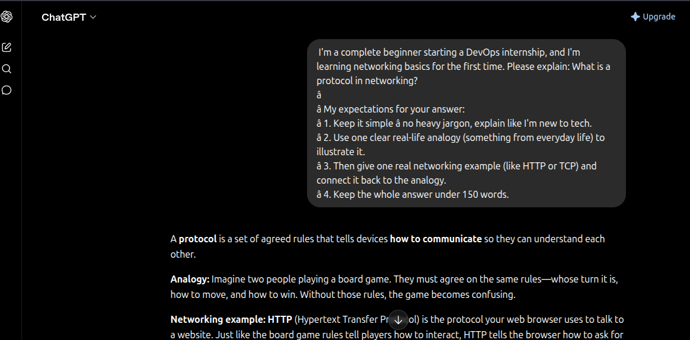
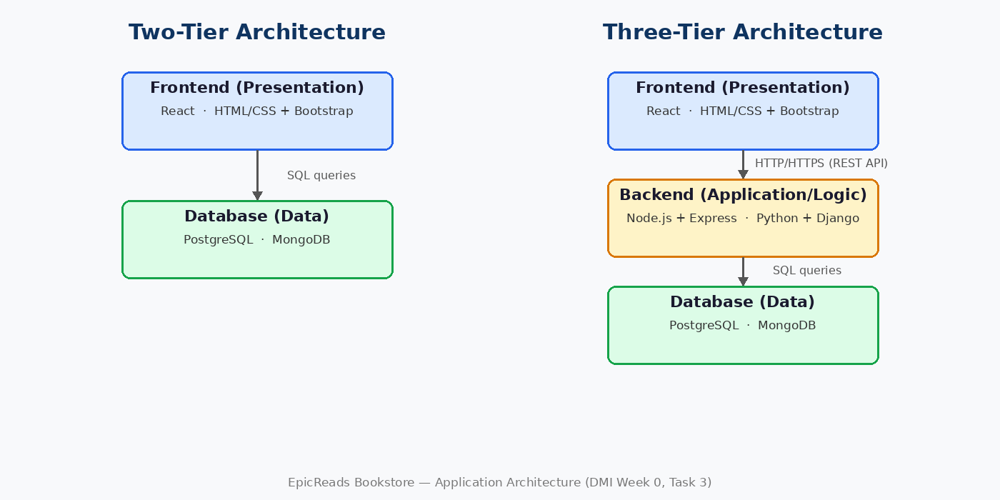

# Week 00 - Internet and Networking

Part of the DevOps Micro Internship (DMI) Cohort 3 with Agentic AI

---

# 🧑‍💻 Task 1: Using ChatGPT as Your Learning Assistant

## Scenario

You're new to DevOps and will frequently encounter technical questions. ChatGPT can be your learning companion.

## Your Task

Write a clear ChatGPT prompt to help you understand:

> "What is a protocol in networking? Explain with a simple real-life example."

Take a screenshot of your interaction showing:

* Your detailed prompt (with clear expectations)
* ChatGPT's simplified response with an example

## Screenshot

Save your screenshot in the `screenshots` folder and update the file name below.



---

## What I Learned (2–3 lines)

A protocol is simply an agreed set of rules that lets two computers communicate, just like two people agreeing on a common language before talking. I also learned that writing a detailed prompt (stating my level, the format I want, and asking for a real-life example) gets me a much clearer answer from ChatGPT than a one-line question.

---

# 🌐 Task 2: Internet and Networking

## Scenario

Your friend is launching an online bookstore named **EpicReads**.

He asked you to explain how users globally can access his website hosted in Finland.

## Your Task

Write a short explanation (**100–150 words**) that includes:

* Packet Switching
* IP Address
* TCP/IP
* HTTP/HTTPS

💡 **Tip:** You may use ChatGPT (as demonstrated in Task 1) to refine your explanation.

## Answer

When someone in India or Brazil opens EpicReads, their browser first needs the server's **IP address** — the unique numeric address that identifies your machine in Finland on the internet. The browser then talks to the server using **TCP/IP**: TCP breaks the request and the web page into small chunks, numbers them, and makes sure nothing is lost, while IP handles addressing and delivery. Those chunks travel by **packet switching** — each packet independently hops across routers and may even take different routes, then gets reassembled in the correct order at the destination. On top of this, the browser and server speak **HTTP** (or **HTTPS**, the encrypted version) — the language used to request pages and send back book listings, images, and checkout data securely. This layered system is why a single server in Finland can serve readers anywhere in the world within milliseconds.

---

# 🏗️ Task 3: Application Architecture & Stack

## Scenario

EpicReads bookstore has two application versions:

### Two-Tier Application

* Frontend
* Database

### Three-Tier Application

* Frontend
* Backend
* Database

## Your Task

* Draw simple diagrams (hand-drawn or tool-based such as draw.io)
* Label each layer clearly
* List at least two common technologies or tools used for each layer
* Submit a screenshot or photo clearly showing your own drawing

## Diagram Screenshot / Photo

Save your diagram image in the `screenshots` folder and update the file name below.



---

## Technologies Used

### Frontend

* React (JavaScript library for building the bookstore UI)
* HTML/CSS with Bootstrap (page structure and responsive styling)

### Backend

* Node.js with Express (handles API requests like search, cart, checkout)
* Python with Django (alternative full-featured backend framework)

### Database

* PostgreSQL (relational DB for books, orders, and users)
* MongoDB (NoSQL option for flexible catalog data)

---

# 🌍 Task 4: Domain Name & DNS (Basic Concepts)

## Scenario

Your friend's bookstore **EpicReads** is currently accessible through:

```text
52.172.142.222:3000
```

He purchased the domain:

```text
epicreads.com
```

## Your Task

In **50–100 words**, explain in your own words:

1. What is DNS (Domain Name System)?
2. Which DNS record type should be used to connect the domain to the given IP, and why?

## Answer

DNS (Domain Name System) is the internet's phonebook: it translates human-friendly domain names like `epicreads.com` into the numeric IP addresses computers actually use, so visitors don't have to remember `52.172.142.222`.

To connect the domain to this IP, an **A record** should be used, because an A record maps a domain name directly to an IPv4 address — which is exactly what `52.172.142.222` is. (Note: DNS only resolves the name to the IP; the port `3000` isn't part of DNS, so the app should ideally be served on standard port 80/443.)

---

# 💻 Task 5: Visual Studio Code Setup (Hands-on)

## Your Task

Install Visual Studio Code (if not already installed).

Take a screenshot of your VS Code environment showing:

* Terminal open inside VS Code
* Running a basic command:

### Windows

```powershell
dir
```

### Linux / macOS

```bash
pwd
ls
```

* Your selected VS Code theme clearly visible

⚠️ **Important:** The screenshot must show your username or another identifiable detail to confirm it is your environment.

## Screenshot

Save your screenshot in the `screenshots` folder and update the file name below.


---

# 🔗 Task 6: Publish Your Assignment as a LinkedIn Post

## Objective

Publishing on LinkedIn helps you:

* Build your professional online presence
* Reinforce your learning
* Document your DevOps journey publicly

## Your Task

Summarize your answers from Tasks 1–5 into a LinkedIn post.

Clearly structure your post into the following sections:

* ChatGPT
* Internet & Networking
* App Architecture
* DNS
* VS Code Setup

Add the following credit note at the end of your post:

> **P.S. This post is part of the DevOps Micro Internship (DMI) with Agentic AI — Cohort 3 — by Pravin Mishra. My graded progress is public: https://dmi.pravinmishra.com/s/YOUR-GITHUB-USERNAME.html · Start your DevOps journey: https://dmi.pravinmishra.com/?utm_source=student&utm_medium=ps-linkedin&utm_campaign=cohort3**

---

## LinkedIn Post URL

Paste your LinkedIn post URL here:

```text
https://www.linkedin.com/posts/chuka-unigwe_so-i-just-wrapped-up-my-week-0-tasks-on-share-7471283605579898880-ILiW/?utm_source=share&utm_medium=member_desktop&rcm=ACoAADapk6QB4YPpujCaTHNEjLTFzWs0c5QVFVQ
```

---

## LinkedIn Post Backup Copy

Paste the full text of your LinkedIn post here:

so, I just wrapped up my week 0 tasks on Devops Micro Internship by Pravin Mishra. 6 tasks to test the waters ( though it was easy for me to navigate...as an OG 😂 ) here's the breakdown.

ChatGPT (Task 1): Moving past generic AI prompts. I use strict structural constraints to enforce technical truth, like tracing low-level protocol behavior, rather than surface-level oversimplifications.

Internet & Networking (Task 2): Traced how data moves globally to a server. HTTP/HTTPS requests data, TCP/IP chops it into packets labeled with the destination IP Address, and Packet Switching routes them independently across global routers before seamless reassembly.

App Architecture (Task 3): Dissected the structural shift from a basic 2-Tier app (Frontend + DB) to a scalable 3-Tier architecture. Introducing a dedicated Backend application tier isolates business logic, making the system secure and independently scalable.

DNS (Task 4): The internet's phonebook. explored how the DNS maps a human-readable domain directly to an IPv4 server address, using the A Record (Address Record) to point traffic straight to the host.

VS Code Setup (Task 5): I set up my vscode, ready for the journey.

P.S. This post is part of the FREE DevOps Micro Internship Cohort run by Pravin Mishra. You can start your DevOps journey for free from his YouTube Playlist @ https://lnkd.in/dkch6rEq

---

# Reflection – Week 0

### What did you find easy?

Using ChatGPT to break down networking concepts felt natural, and the VS Code setup was straightforward since I already work in a Linux environment. The high-level ideas (DNS as a phonebook, protocols as shared rules) clicked quickly with real-life analogies.

---

### What was difficult?

Condensing the internet/networking explanation into 100–150 words while still covering packet switching, IP, TCP/IP, and HTTP/HTTPS accurately took a few rewrites. Deciding what to leave out was harder than deciding what to include.

---

### What will you improve next week?

I want to rely less on analogies and more on hands-on verification — e.g., using `dig`, `ping`, and `traceroute` to actually observe DNS resolution and packet routing instead of just describing them. I'll also start my assignments earlier in the week to leave time for review.

---

## 📌 About DMI & CloudAdvisory

DevOps Micro Internship (DMI) is a project-based DevOps program run by Pravin Mishra (The CloudAdvisory) focused on real-world execution, systems thinking, and career readiness.

It helps learners build strong DevOps foundations with hands-on experience.


## 📌 Resources

- 🌐 **DMI Official Website:** https://dmi.pravinmishra.com?utm_source=github&utm_medium=readme  
- 🎓 **University:** https://university.pravinmishra.com?utm_source=github&utm_medium=readme  
- 💬 **Discord Community:** https://discord.pravinmishra.com?utm_source=github&utm_medium=readme  
- 📝 **Blog:** https://dmi.pravinmishra.com/blog?utm_source=github&utm_medium=readme  
- ▶️ **YouTube Playlist (DMI Cohort 3):** https://www.youtube.com/playlist?list=PLFeSNDtI4Cho  
- 🔗 **Pravin Mishra (LinkedIn):** https://www.linkedin.com/in/pravin-mishra-aws-trainer/  
- 🏢 **CloudAdvisory (LinkedIn):** https://www.linkedin.com/company/thecloudadvisory/

---

*This submission is part of DevOps Micro Internship (DMI) Cohort 3 — Agentic AI Track*