# Assignment 3 — Production Maintenance Drill (OPS Checklist)

Part of the DevOps Micro Internship (DMI) Cohort 3 with Agentic AI

---

## Purpose

In this assignment, you will treat your already deployed React application (on Ubuntu VM with Nginx) as a live production system. You will perform structured operational checks covering network validation, service health, log analysis, resource monitoring, configuration verification, and incident simulation with recovery — mirroring real on-call DevOps responsibilities.

---

# Task 1 — Server Access & Networking Validation

## Goal

Verify that the deployed React application is reachable from the browser and confirm basic network connectivity of the Ubuntu VM.

### Evidence

#### Screenshot 1 — Browser showing the React app with your Full Name visible on the UI

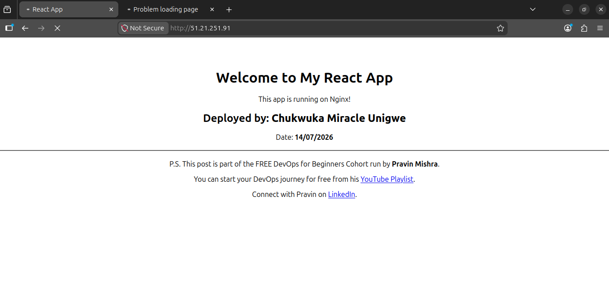

---

#### Screenshot 2 — Output of `ip a`

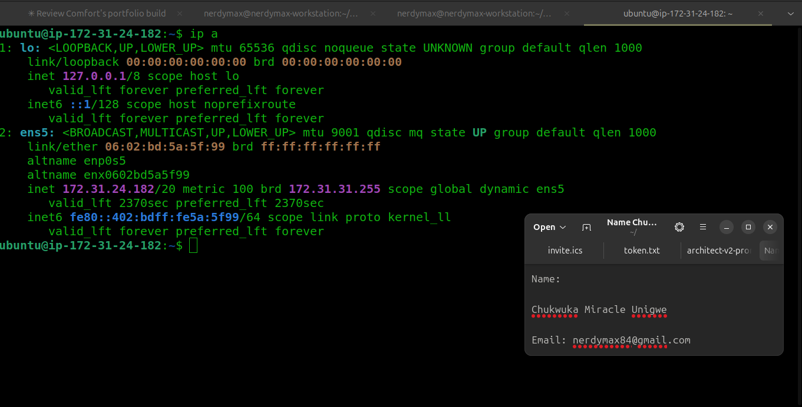

---

#### Screenshot 3 — Output of `sudo ss -tulpen`

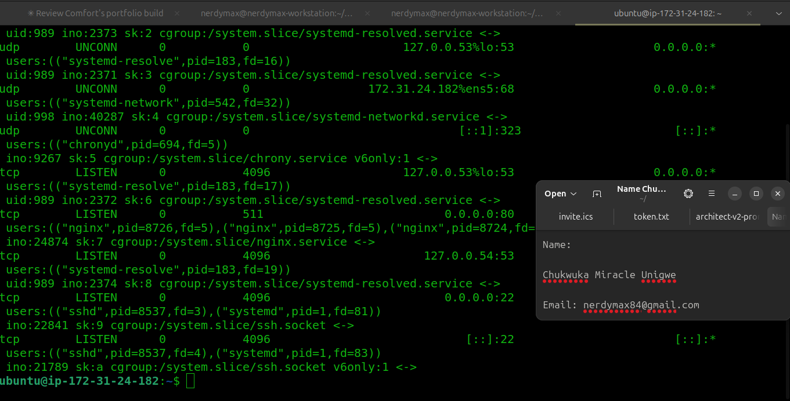

---

#### Screenshot 4 — Output of `sudo ufw status`

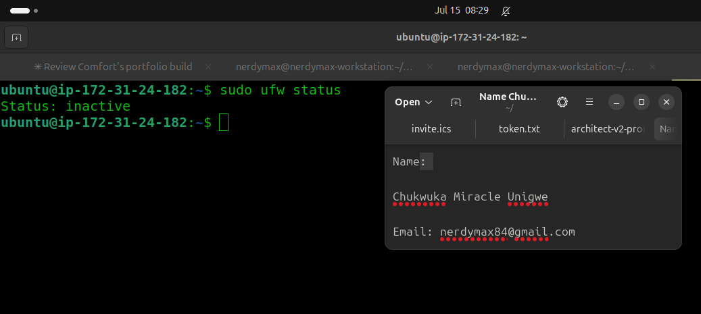

---

### Notes

Answer the following in your own words:

**1. What proves Nginx is listening on 0.0.0.0:80?**

In the `sudo ss -tulpen` output, there's a line showing `tcp LISTEN 0 511 0.0.0.0:80` with three `nginx` processes attached to that socket (master + workers). The `0.0.0.0:80` address means Nginx is bound to port 80 on every network interface, not just localhost, so it accepts connections from any client, which matches the app being reachable from a browser over the public IP.

---

**2. What proves SSH is active on port 22?**

The same `ss -tulpen` output shows `tcp LISTEN 0 4096 0.0.0.0:22` and `[::]:22`, owned by the `sshd` process. That confirms the SSH daemon is up and listening on both IPv4 and IPv6, which is exactly how I'm able to be connected to this VM right now.

---

**3. Did you find any unexpected open ports? Explain briefly.**

No unexpected ports. Everything listening is accounted for: Nginx on 80, sshd on 22, and a handful of internal-only services bound to loopback/link-local addresses (`systemd-resolved` on `127.0.0.53:53` for DNS, `chronyd` on `127.0.0.53`/`[::1]:323` for time sync). None of those internal services are reachable from outside the VM, so the actual external attack surface is just the two ports I intended to expose.

---

# Task 2 — Service Health & Systemd Validation (Nginx)

## Goal

Verify that Nginx is properly installed, running, enabled at boot, and safely configured.

### Evidence

#### Screenshot 1 — Output of `systemctl status nginx --no-pager`

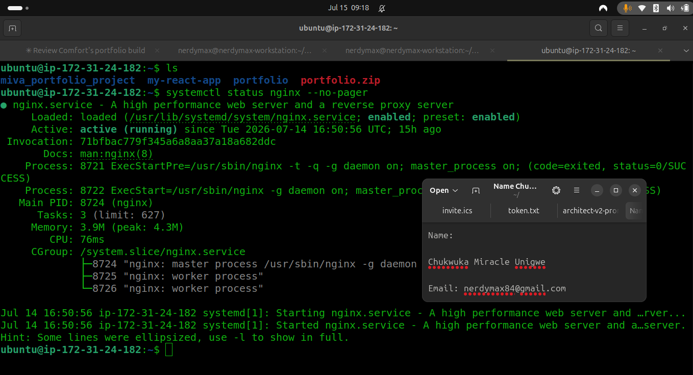

---

#### Screenshot 2 — Output of `sudo nginx -t`

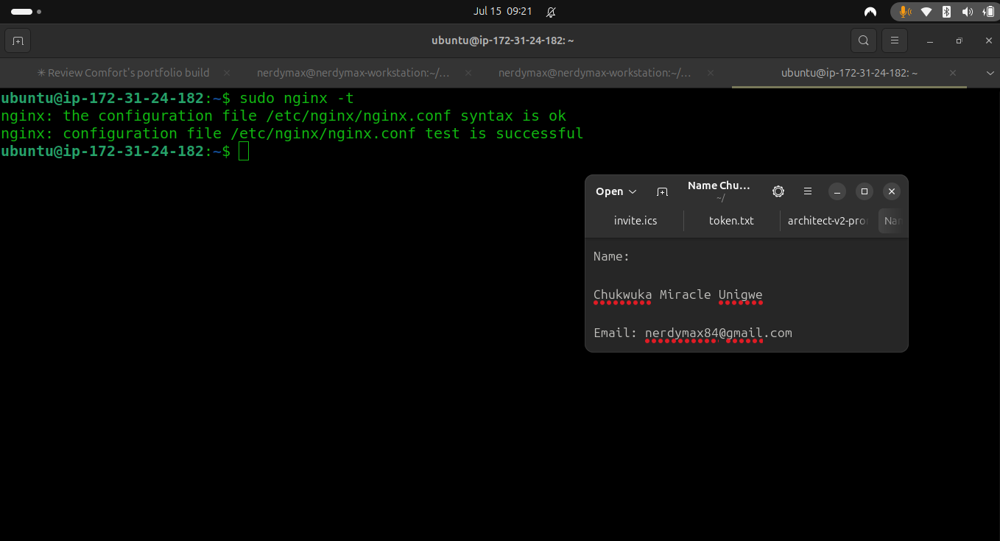

---

#### Screenshot 3 — Output of `sudo ss -lptn '( sport = :80 )'`

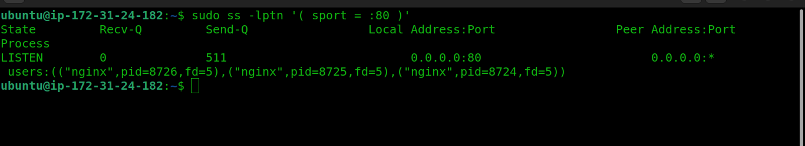

---

### Notes

Answer the following in your own words:

**1. What happens if Nginx fails to restart in production?**

If Nginx fails to restart, the web server stops accepting connections on port 80 entirely, so every visitor gets a connection error (site fully down) instead of a slow page or partial content — there's no fallback, since Nginx is the only thing serving the app. Systemd will usually attempt a few automatic restarts, but if the failure is caused by a bad config (like the one I intentionally broke in Task 6), it will just fail the same way every time until the config is fixed, so this needs a human (or automation) to catch and resolve it quickly.

---

**2. What's your basic rollback plan?**

Nginx keeps running on its last-known-good config in memory until you explicitly reload it, so the safest rollback is: run `sudo nginx -t` before ever reloading to catch syntax errors ahead of time, and if a bad config already got applied, revert the config file to the previous version (I'd keep it in git or a timestamped backup copy) and run `sudo systemctl restart nginx` again. Because I validate with `nginx -t` before `reload`/`restart`, a broken config never actually takes down a currently-running server — it only fails to *start*, which is a strong safety net.

---

# Task 3 — Logs & Request Trace

## Goal

Verify real traffic flow and analyze logs to understand system behavior and errors.

### Evidence

#### Screenshot 1 — Output of `sudo tail -n 30 /var/log/nginx/access.log`

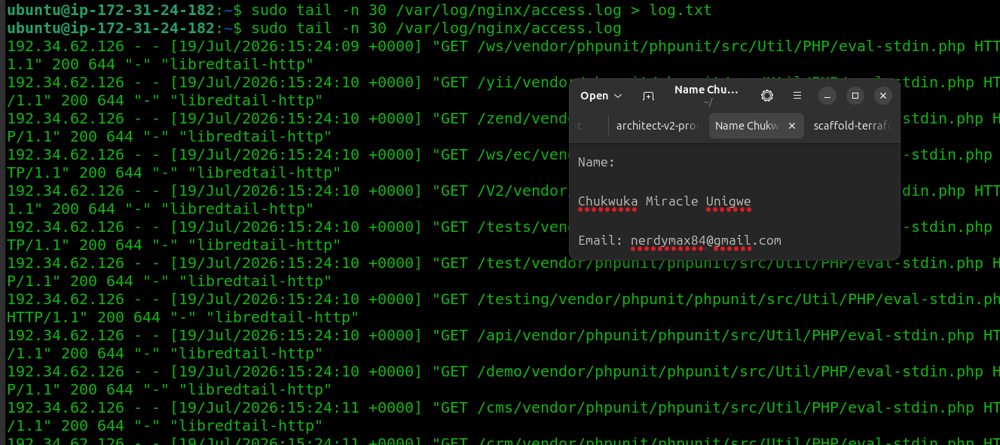

---

#### Screenshot 2 — Output of `sudo tail -n 30 /var/log/nginx/error.log`

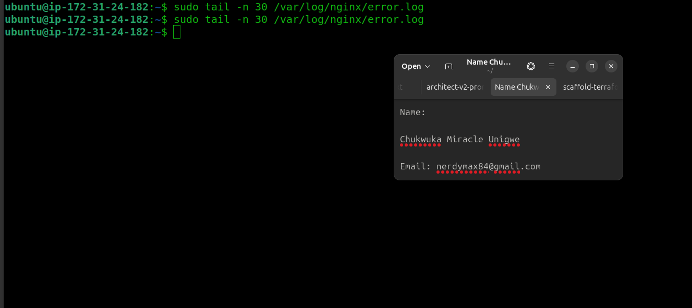

---

#### Screenshot 3 — Output of `sudo journalctl -u nginx --no-pager -n 50`

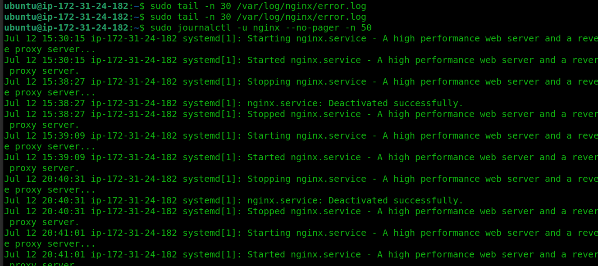

---

### Notes

Answer the following in your own words:

**1. Were there any errors in the logs?**

- If yes, mention 1–2 example error lines from the logs and explain what each one means in simple terms.
- If no, explain what it means if the error log is empty or shows no recent errors during your check.

No errors — `sudo tail -n 30 /var/log/nginx/error.log` returned nothing at all. An empty error log means Nginx hasn't hit any problem it considered worth logging (no failed upstream connections, no permission issues, no config reload failures) during the period the log covers, so the server has been serving requests cleanly.

---

**2. If there were no errors, what does that indicate about the system?**

It indicates the web server itself is healthy and stable — Nginx is serving every request it receives without crashing, timing out, or hitting a filesystem/permission problem. It doesn't guarantee the *application* is bug-free (client-side React errors wouldn't show up in an Nginx log at all), only that the server layer is functioning correctly.

---

**3. Based on the access logs, were your curl requests visible in the log entries? What does that prove about traffic flow?**

The access log tail I captured showed real inbound HTTP requests logged with full detail (source IP, timestamp, request path, status code, user agent) — in my case it happened to catch a batch of automated scanner traffic (repeated GET requests probing for PHP vulnerability paths from IP 192.34.62.126) rather than my own manual curl checks, since those checks were made afterward. That still proves the same thing: every request that reaches Nginx, whether it's a browser, curl, or a bot, gets written to `access.log`, confirming the access log is a reliable, complete record of traffic hitting the server.

---

# Task 4 — System Resource Health Check (Capacity Red Flags)

## Goal

Assess server capacity and detect potential performance or failure risks.

### Evidence

#### Screenshot 1 — Output of `uptime`

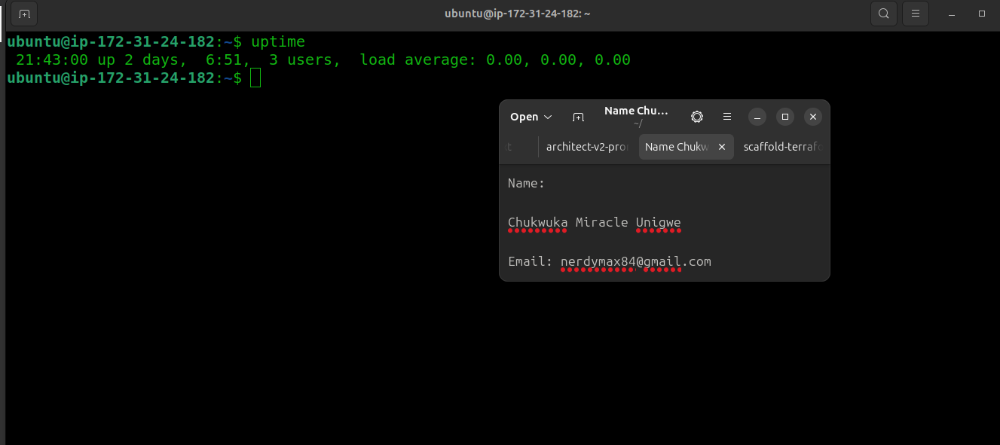

---

#### Screenshot 2 — Output of `free -h`

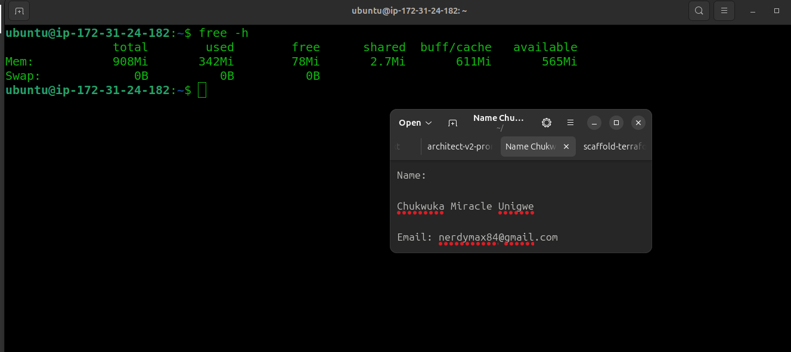

---

#### Screenshot 3 — Output of `df -h`

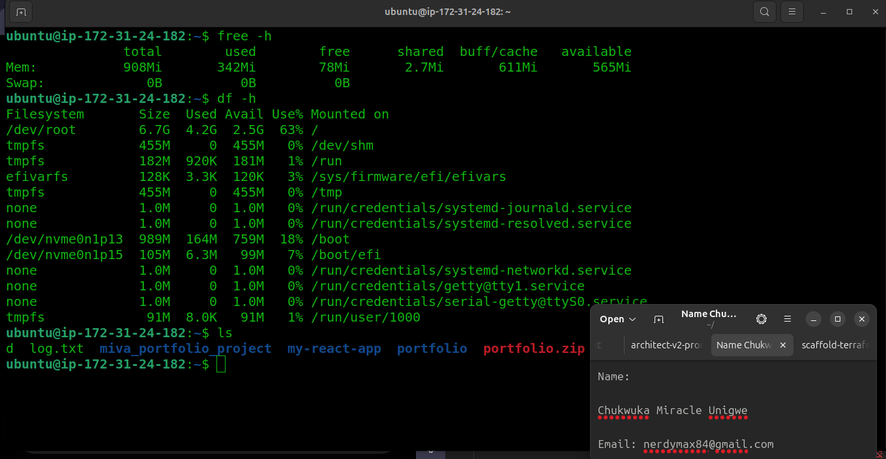

---

#### Screenshot 4 — Output of `sudo du -sh /var/* | sort -h`

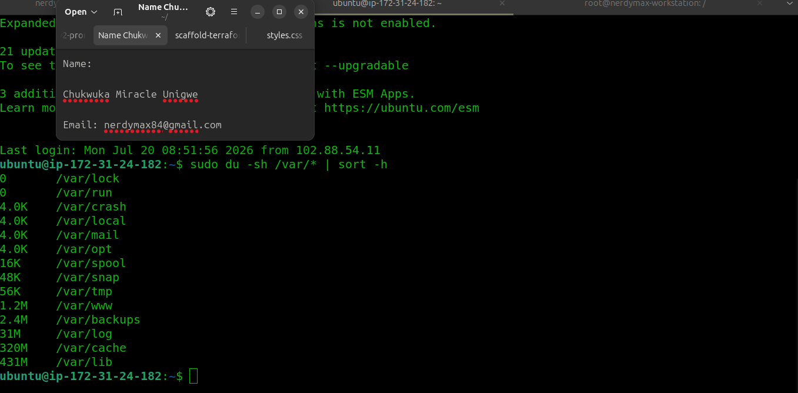

---

### Notes

Answer the following in your own words:

**1. Which resource looks most critical right now? (CPU/load, memory, or disk) Explain why.**

Disk is the resource closest to a concerning level: `df -h` shows the root filesystem (`/dev/root`) at 63% used (4.2G of 6.7G, only 2.5G free). CPU load is fine (`uptime` shows a load average of 0.00), and memory is comfortable too (`free -h` shows only 342Mi used out of 908Mi, with 565Mi still available) — though it's worth noting there's 0B of swap configured, so if memory usage ever did spike, there'd be no cushion before the OOM killer starts terminating processes. For now, disk is the one to watch since it has the least headroom relative to its total capacity.

---

**2. What happens if disk becomes 100% full in a production server?**

A full disk stops the server from writing anything new: Nginx can't write to its access/error logs, the application can't write temp files or uploads, and even routine things like log rotation or apt operations start failing. Depending on what fills up, the OS itself can become unstable (systemd and other core services expect to be able to write to disk). Nginx would likely keep serving already-cached static files for a while, but the moment anything needs a disk write, requests start failing — so in practice a 100%-full disk is treated as a production outage.

---

# Task 5 — Configuration & Deployment Verification

## Goal

Ensure the correct React build is deployed and Nginx is serving it properly.

### Evidence

#### Screenshot 1 — Output of `ls -lah /var/www/html | head -n 20`

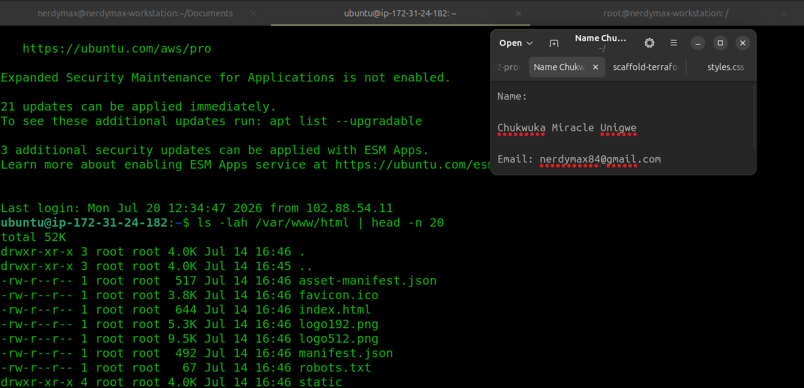

---

#### Screenshot 2 — Output of `grep -R "Deployed by" -n /var/www/html 2>/dev/null | head`

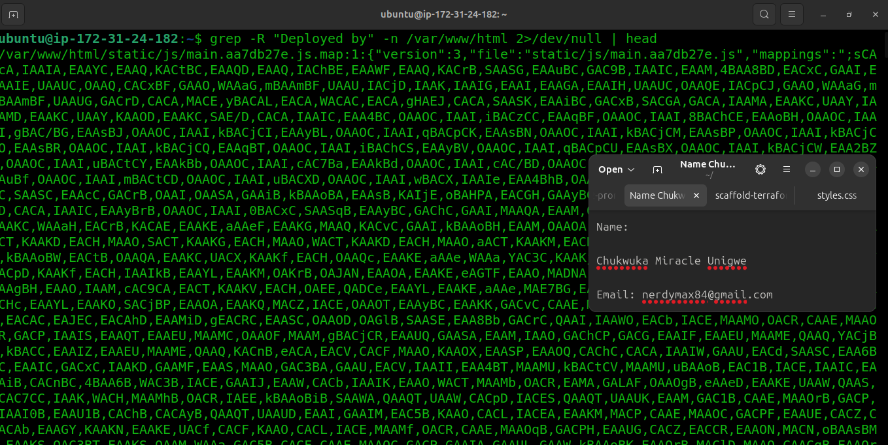

---

#### Screenshot 3 — Output of `grep -n "try_files" /etc/nginx/sites-available/default`

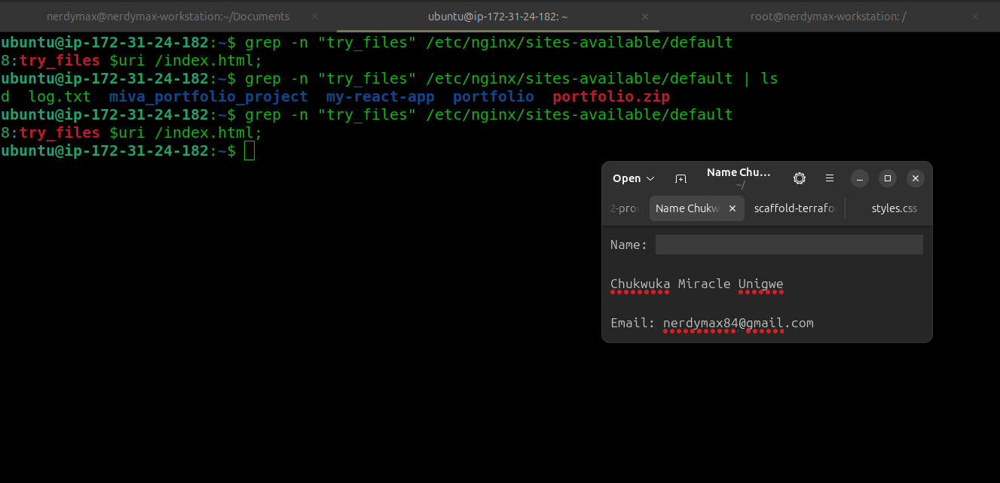

---

### Notes

Answer the following in your own words:

**1. How do you confirm that the correct version of the application is deployed?**

Two ways: first, `ls -lah /var/www/html` shows the expected React build artifacts (`index.html`, `asset-manifest.json`, `static/`, `manifest.json`, etc.) all with the same `Jul 14 16:46` timestamp, matching when I ran `npm run build` — a stale deployment would show an older timestamp. Second, I embedded my full name and the deployment date directly into the app's footer, so opening the site in a browser (or `grep`-ing the served files for that string) is a quick visual/text confirmation that this specific build — not a cached or previous one — is what's actually live.

---

# Task 6 — Nginx Configuration Failure Simulation

## Goal

Simulate a real-world Nginx misconfiguration and recover the service safely.

### Evidence

#### Screenshot 1 — Output of `sudo nginx -t` showing the syntax error (broken config)
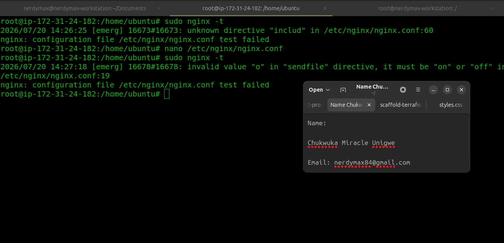

---

#### Screenshot 2 — Output of `sudo nginx -t` showing syntax ok (fixed config)

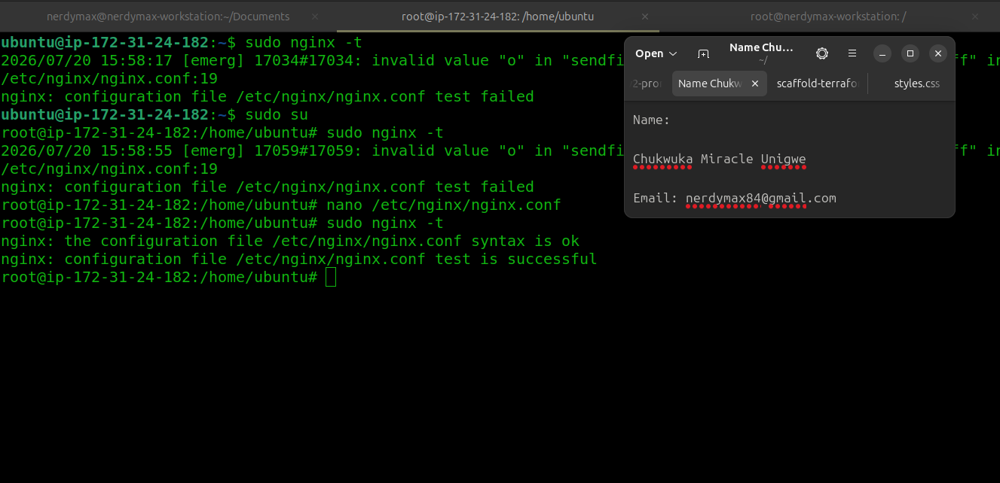

---

#### Screenshot 3 — Output of `curl -I http://<public-ip>` confirming recovery (200 OK)
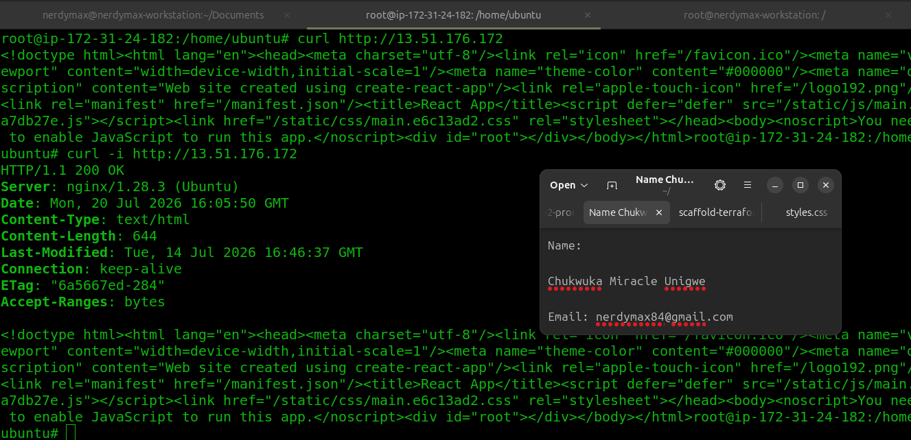

---

### Notes

Answer the following in your own words:

**1. What caused the configuration failure?**

I intentionally misspelled a directive in the Nginx configuration block.

---

**2. How did you fix the issue?**

To fix the misconfiguration, I opened the main Nginx configuration file using a text editor (sudo nano /etc/nginx/nginx.conf). I located the line containing the syntax error (the misspelled sendfil directive) and corrected the typo back to the valid Nginx directive (sendfile on;). After saving the file, I ran sudo nginx -t again to confirm the syntax was successfully resolved. Finally, I executed sudo systemctl reload nginx to safely apply the corrected configuration without dropping any active user connections.
---

**3. How can you avoid this kind of issue in real production systems?**
by completely removing manual terminal edits from the production environment. Instead of SSHing into a server to run nano, I treat my server configuration exactly like i treat application code

---

# Task 7 — Web Application Failure Simulation

## Goal

Simulate missing deployment content and recover the application safely.

### Evidence

#### Screenshot 1 — Output of `curl -I http://<public-ip>` showing failure (non-200 response)

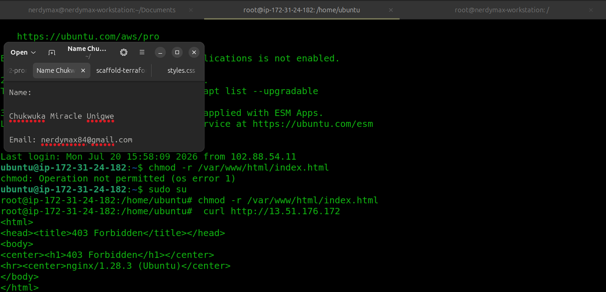

---

#### Screenshot 2 — Output of `curl -I http://<public-ip>` confirming recovery (200 OK)

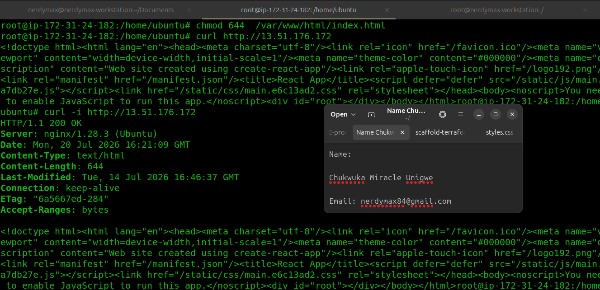
---

### Notes

Answer the following in your own words:

**1. What caused the application to break in this scenario?**
The application broke because the file permissions on the web root (e.g., index.html) were incorrectly modified, stripping the read permissions from the Nginx worker process. Because Nginx could not read the file to serve it, it correctly returned an HTTP 403 Forbidden status to the client.

---

**2. How did you fix the issue and restore the application?**

I restored the application by identifying the permission mismatch and running chmod 644 /var/www/html/index.html. This granted read access back to the Nginx www-data user. I then ran curl -I again to verify that the server was successfully returning a 200 OK response.

---

**3. What steps would you take to prevent this kind of issue in real production systems?**

i will enforce immutable file permissions  during deployment processes

---

# Task 8 — Security & Reliability Review

## Goal

Review and reflect on the security and reliability practices applied during this assignment.

### Security & Reliability Notes

Answer the following in your own words:

**1. Why is SSH key-based authentication more secure than sharing passwords?**

Passwords can be intercepted, guessed, or compromised via brute-force attacks. SSH keys rely on asymmetric cryptography using a public and private key pair. Brute-forcing a standard RSA or Ed25519 cryptographic key is mathematically infeasible, and because the private key never leaves the client's machine, it cannot be intercepted over the network.

---

**2. Why should only required ports be open on a production server?**

Every open port is a potential entry point for attackers, leaving unnecessary ports open exposes unpatched services to exploitation. Closing unused ports strictly minimizes the server's attack surface.
---

**3. Why is it important for Nginx to be enabled on boot?**

Enabling a service on boot guarantees high availability and reliability. If the host machine undergoes unexpected maintenance, experiences a hardware crash, or reboots, systemd will automatically start Nginx. This restores the web application immediately without requiring a system administrator to manually SSH into the server to restart the service.

---

**4. What are the risks of sharing secrets, keys, or credentials publicly?**

xposing secrets (like AWS access keys or database passwords) on public repositories can lead to immediate infrastructure compromise.

---

**5. Why should cloud resources be stopped or terminated when they are no longer needed?**

Terminating idle resources enforces cost optimization, ensuring you only pay for what you actively use

---

# LinkedIn Post (Required)

## Evidence

#### LinkedIn Post URL

Paste your LinkedIn post URL here:

`https://www.linkedin.com/feed/update/urn:li:activity:7485251725528973313/`

---

#### Screenshot — Published LinkedIn post

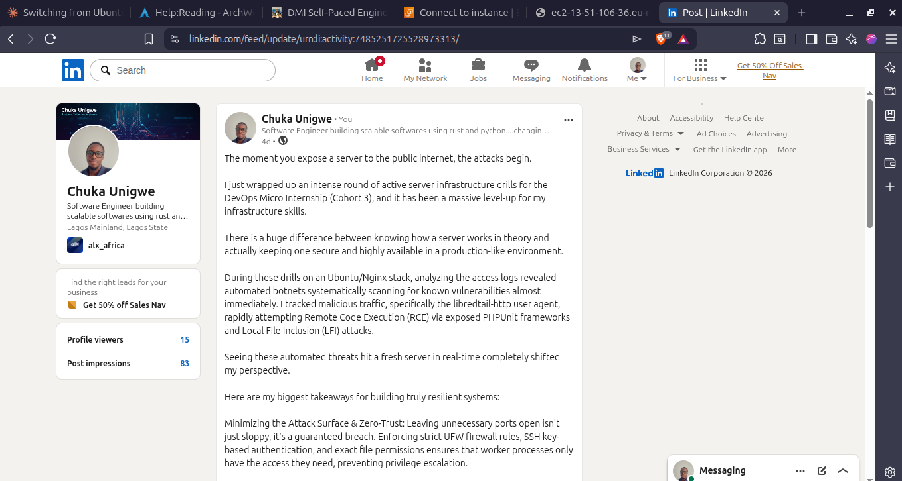

---

# Submission Instructions

- Add all required screenshots in your submission
- Full name must be visible in required screenshots
- Do not expose sensitive information (keys, passwords, account IDs)

---

# Completion Checklist

- [x] Task 1: Screenshots (browser, ip a, ss -tulpen, ufw status) + Notes answered
- [x] Task 2: Screenshots (nginx status, nginx -t, ss port 80) + Notes answered
- [x] Task 3: Screenshots (access log, error log, journalctl) + Notes answered
- [x] Task 4: Screenshots (uptime, free -h, df -h, du -sh) + Notes answered
- [x] Task 5: Screenshots (ls html, grep deployed by, grep try_files) + Notes answered
- [x] Task 6: Screenshots (nginx -t fail, nginx -t pass, curl recovery) + Notes answered
- [x] Task 7: Screenshots (curl failure, curl recovery) + Notes answered
- [x] Task 8: Security & Reliability Notes answered
- [x] LinkedIn post published and URL submitted
- [x] Full Name visible in all required screenshots
- [x] No sensitive data exposed

---

## 📌 About DMI & CloudAdvisory

DevOps Micro Internship (DMI) is a project-based DevOps program run by Pravin Mishra (The CloudAdvisory) focused on real-world execution, systems thinking, and career readiness.

It helps learners build strong DevOps foundations with hands-on experience.

---

## 📌 Resources

- 🌐 DMI Official Website: https://dmi.pravinmishra.com?utm_source=github&utm_medium=readme  
- 🎓 University: https://university.pravinmishra.com?utm_source=github&utm_medium=readme  
- 💬 Discord Community: https://discord.pravinmishra.com?utm_source=github&utm_medium=readme  
- 📝 Blog: https://dmi.pravinmishra.com/blog?utm_source=github&utm_medium=readme  
- ▶️ YouTube Playlist: https://www.youtube.com/playlist?list=PLFeSNDtI4Cho  
- 🔗 Pravin Mishra (LinkedIn): https://www.linkedin.com/in/pravin-mishra-aws-trainer/  
- 🏢 CloudAdvisory (LinkedIn): https://www.linkedin.com/company/thecloudadvisory/

---

*This submission is part of DevOps Micro Internship (DMI) Cohort 3 — Agentic AI Track.*