# Assignment 5 — Bash Script Automation Drill (OPS Checklist)

Part of the DevOps Micro Internship (DMI) Cohort 3 with Agentic AI

---

## Purpose

In this assignment, you will practice Bash scripting by building a series of small automation scripts covering environment setup, variables, arrays, loops, file conditionals, if-else logic, and functions. These scripts form the foundation of real-world Linux automation used in DevOps, cloud, and production support environments.

---

# Task 1 — Bash Environment & Workspace Setup

## Goal

Verify that Bash is available on your system and create a clean workspace for this assignment.

### Evidence

#### Screenshot 1 — Output of `echo $SHELL` and `bash --version`

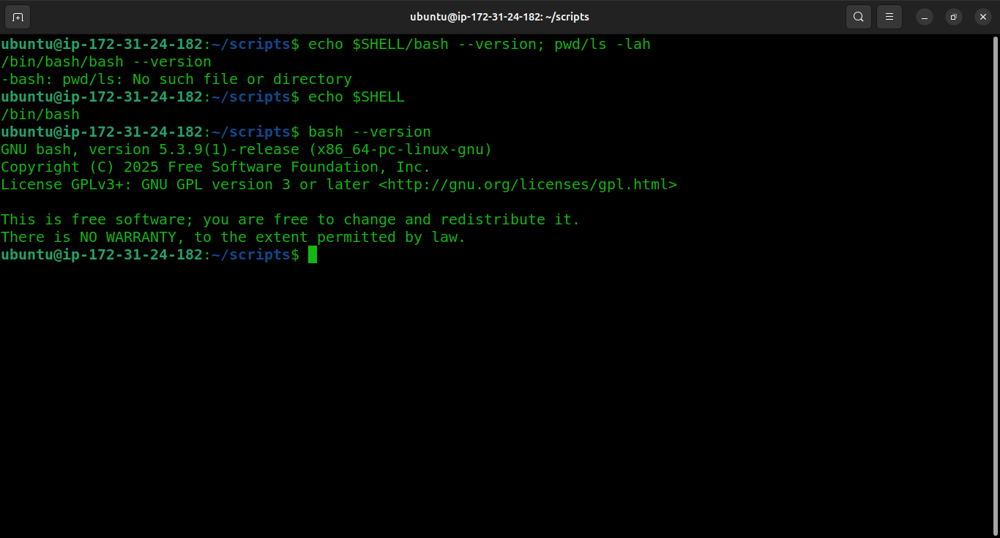

---

#### Screenshot 2 — Output of `pwd` and `ls -lah` showing the scripts directory

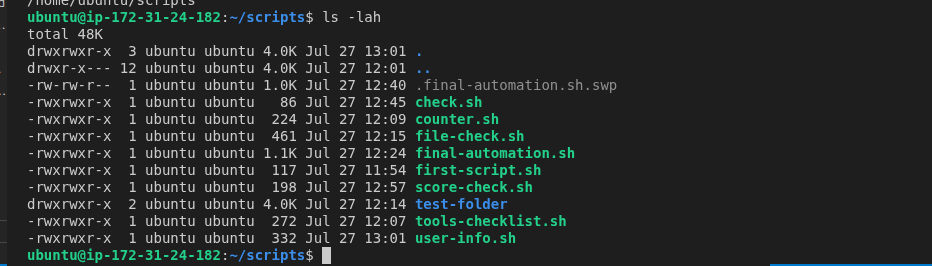

> Note: `.final-automation.sh.swp` is visible in this listing — a leftover nano swap file, usually from an editor session that wasn't closed cleanly. Worth deleting (`rm .final-automation.sh.swp`) once you're done editing, or nano will prompt about recovering a swap file next time you open `final-automation.sh`.

---

### Notes

Answer the following in your own words:

**1. What is Bash?**

Bash (Bourne Again SHell) is a command-line interpreter and scripting language for Unix/Linux systems. It lets you run commands interactively and also write scripts that automate sequences of commands.

---

**2. What is the difference between shell and Bash?**

"Shell" is the general term for any command-line interpreter that lets a user interact with the OS (e.g. sh, zsh, ksh, Bash). Bash is one specific implementation of a shell — the most common default on Linux — with its own extra features like arrays, `[[ ]]` conditionals, and command history.

---

**3. Why is it important to confirm the Bash version before writing scripts?**

Different Bash versions support different features (e.g. associative arrays require Bash 4+). Confirming the version up front avoids writing scripts that fail or behave unexpectedly on the target system.

---

# Task 2 — Your First Bash Script

## Goal

Create your first Bash script, make it executable, and run it from the terminal.

### Evidence

#### Screenshot 1 — Content of `first-script.sh`

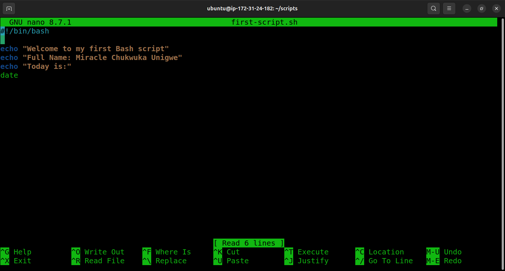

---

#### Screenshot 2 — Output of `./first-script.sh`

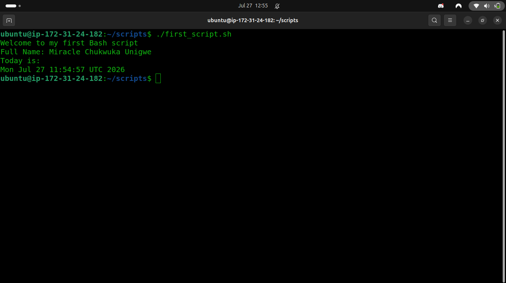

---

#### Screenshot 3 — Output of `ls -l first-script.sh` showing executable permission

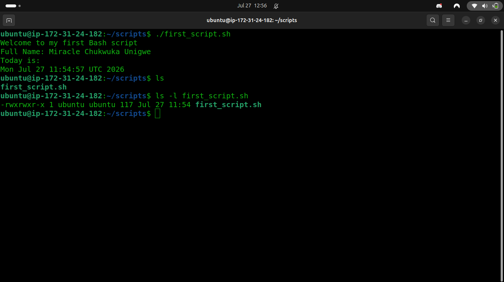

---

### Notes

Answer the following in your own words:

**1. What is the purpose of `#!/bin/bash`?**

It's the "shebang" line. It tells the OS which interpreter to use to run the rest of the file — in this case, `/bin/bash` — so the script executes correctly regardless of which shell the user is currently in.

---

**2. Why do we use `chmod +x` before running a script?**

By default, new files aren't marked executable. `chmod +x` adds the execute permission so the script can be run directly as a program (e.g. `./script.sh`) instead of always having to invoke it via `bash script.sh`.

---

**3. What is the difference between running a script using `./script.sh` and `bash script.sh`?**

`./script.sh` executes the file directly using the OS's execute permission and the interpreter named in its shebang line (requires the file to be executable). `bash script.sh` explicitly runs the file's contents through the `bash` interpreter regardless of its permissions or shebang line.

---

# Task 3 — Variables: User Information Script

## Goal

Use variables to store and display user-related information.

### Evidence

#### Screenshot 1 — Content of `user-info.sh`

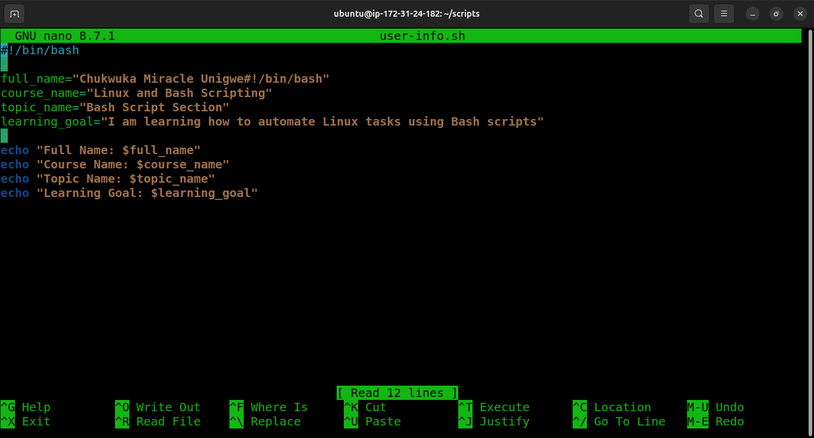

> ⚠️ Bug: line 3 currently reads `full_name="Chukwuka Miracle Unigwe#!/bin/bash"` — the shebang text got merged into the string value by mistake. It happens not to break this particular output, but it's wrong and will look bad in review. Fix the line to just `full_name="Chukwuka Miracle Unigwe"`, save, and retake this screenshot.

---

#### Screenshot 2 — Output of `./user-info.sh`

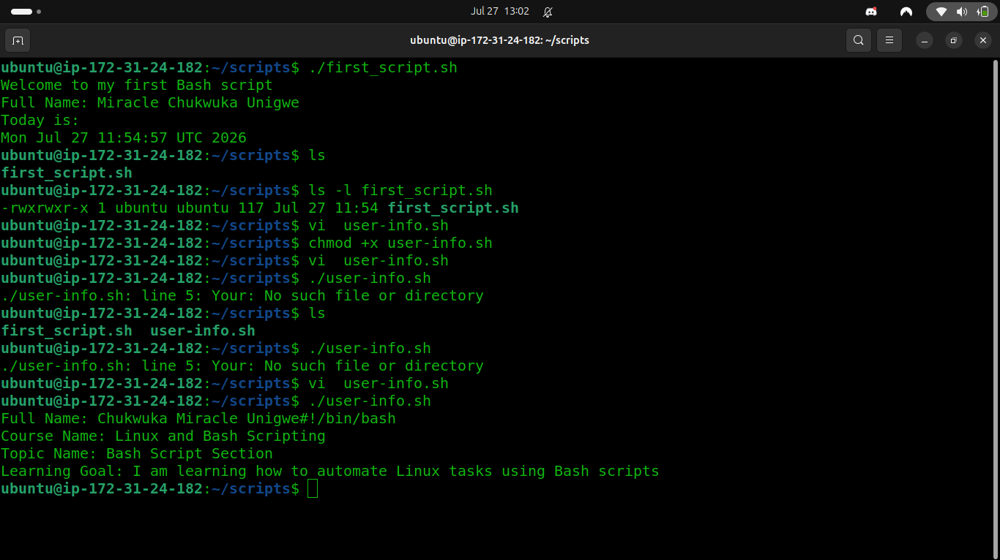

---

### Notes

Answer the following in your own words:

**1. What is a variable in Bash?**

A named storage location that holds a value (text, a number, a path, etc.) which can be referenced and reused later in the script, e.g. `name="Max"`.

---

**2. Why should we avoid spaces around the `=` sign when creating variables?**

Bash parses `name = "Max"` as running a command called `name` with arguments `=` and `"Max"`, not as an assignment. Only `name="Max"` (no spaces) is treated as a variable assignment.

---

**3. How do you access the value stored inside a Bash variable?**

By prefixing it with `$`, e.g. `echo $name` or `echo "${name}"`. The braces form is safer when the variable name is adjacent to other text.

---

# Task 4 — Arrays & Loops: Tools Checklist Script

## Goal

Use arrays and loops to print a checklist of tools used in Bash scripting.

### Evidence

#### Screenshot 1 — Content of `tools-checklist.sh`

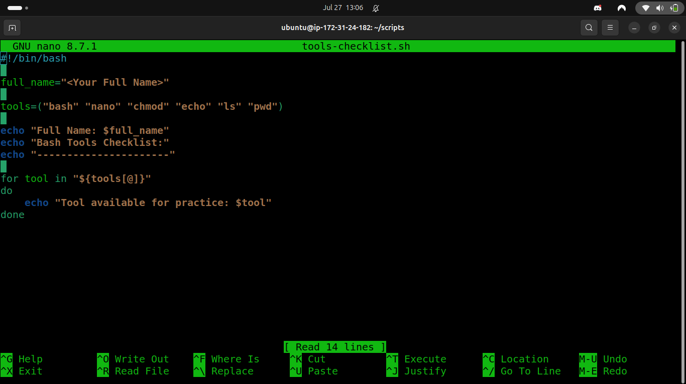

---

#### Screenshot 2 — Output of `./tools-checklist.sh`

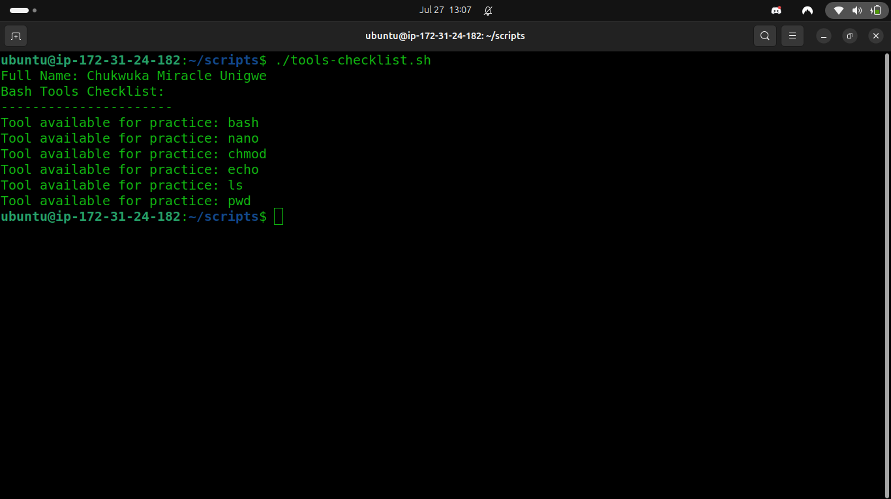

---

### Notes

Answer the following in your own words:

**1. What is an array in Bash?**

A variable that can hold multiple values (a list) instead of just one, e.g. `tools=("git" "docker" "nginx")`.

---

**2. Why are arrays useful in scripts?**

They let you group related items together and process them all with a loop, instead of writing repetitive code for each item individually — cleaner and easier to maintain.

---

**3. What does `"${tools[@]}"` mean?**

It expands to all the elements of the `tools` array, each as a separate, properly quoted word — important when array items might contain spaces.

---

**4. What is the purpose of the `for` loop in this script?**

It iterates over each item in the `tools` array one at a time, printing or checking each tool in the checklist without needing separate code per item.

---

# Task 5 — Loops: Number Counter Script

## Goal

Use loops to repeat a task multiple times.

### Evidence

#### Screenshot 1 — Content of `counter.sh`

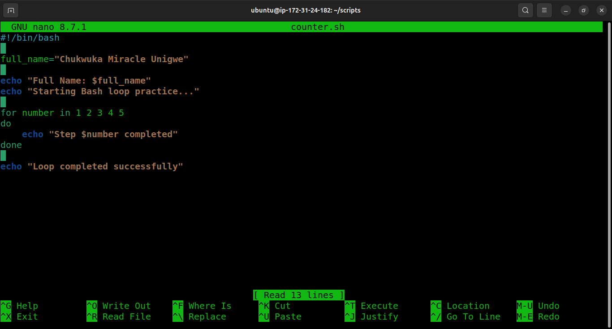

---

#### Screenshot 2 — Output of `./counter.sh`

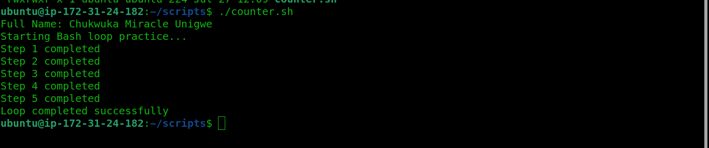

---

### Notes

Answer the following in your own words:

**1. What is a loop?**

A control structure that repeats a block of commands multiple times, either a fixed number of times or until a condition is no longer true.

---

**2. Why do we use loops in Bash scripting?**

To avoid repeating the same commands manually — loops let a script automate repetitive tasks (like counting, processing lists of files, or retrying an operation) with just a few lines of code.

---

**3. How many times did the loop run in your script?**

5 times — the output shows "Step 1 completed" through "Step 5 completed" before "Loop completed successfully".

---

**4. What would you change if you wanted the loop to run 10 times?**

Change the loop's range/condition to cover 10 iterations, e.g. `for i in {1..10}` instead of `{1..5}`.

---

# Task 6 — Files & Conditionals: File Validation Script

## Goal

Use file checks and conditionals to verify whether files and directories exist.

### Evidence

#### Screenshot 1 — Output of `ls -lah ../test-folder`

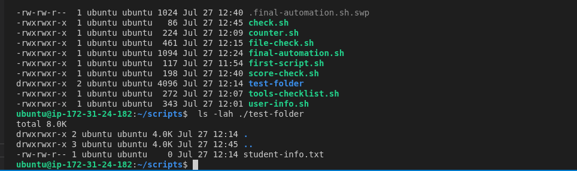

> Your `test-folder` actually lives inside `~/scripts` (i.e. `./test-folder`), not one level up, so this screenshot shows `ls -lah ./test-folder` instead — consistent with how `file-check.sh` references it.

---

#### Screenshot 2 — Content of `file-check.sh`

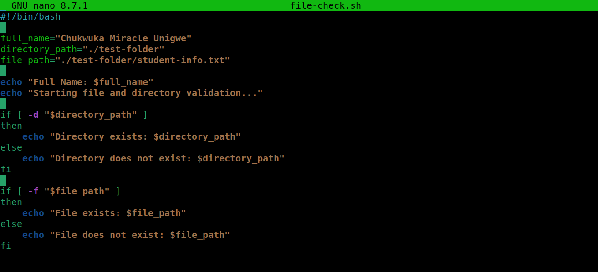

---

#### Screenshot 3 — Output of `./file-check.sh`

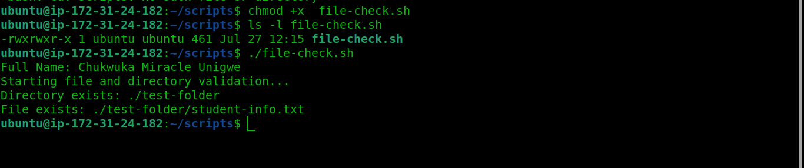

---

### Notes

Answer the following in your own words:

**1. What does `-d` check in Bash?**

Whether the given path exists and is a directory, e.g. `if [ -d "$path" ]`.

---

**2. What does `-f` check in Bash?**

Whether the given path exists and is a regular file, e.g. `if [ -f "$path" ]`.

---

**3. Why should file and directory paths be stored in variables?**

It avoids repeating the same hardcoded path throughout the script, makes the script easier to update (change the path in one place), and reduces the risk of typos causing mismatched paths.

---

**4. What happens if the file does not exist?**

The `-f` (or `-d`) test evaluates to false, so the conditional's `else` branch runs — typically printing an error/warning message instead of trying to operate on a nonexistent file.

---

# Task 7 — Conditionals: Pass or Retry Script

## Goal

Use if-else conditionals to make decisions based on a variable value.

### Evidence

#### Screenshot 1 — Content of `score-check.sh` with `score=85`

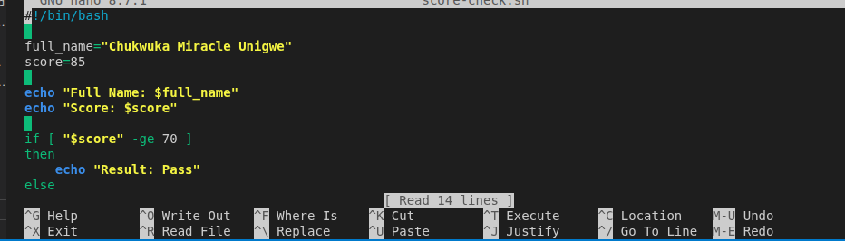

---

#### Screenshot 2 — Output showing `Result: Pass`

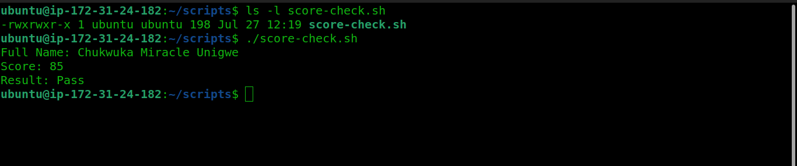

---

#### Screenshot 3 — Content of `score-check.sh` with `score=55`

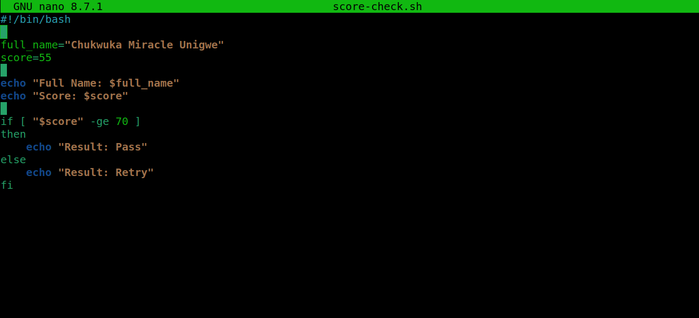

---

#### Screenshot 4 — Output showing `Result: Retry`

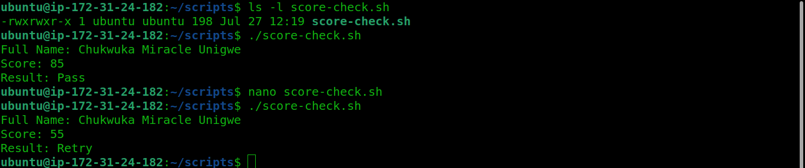

---

### Notes

Answer the following in your own words:

**1. What is the purpose of if-else in Bash?**

It lets a script branch its behavior based on a condition — running one block of commands if the condition is true, and a different block if it's false.

---

**2. What does `-ge` mean?**

"Greater than or equal to" — a numeric comparison operator used in test conditions, e.g. `[ "$score" -ge 60 ]`.

---

**3. Why should conditions be tested with different values?**

To confirm both branches of the logic actually work as intended — testing only one value (e.g. always a passing score) wouldn't catch bugs in the "else"/failing path.

---

**4. How can conditionals help in automation scripts?**

They let scripts make decisions automatically — e.g. checking a status, a threshold, or whether a file exists — and take the appropriate action without manual intervention, which is essential for unattended automation.

---

# Task 8 — Functions: Final Bash Automation Script

## Goal

Create a final Bash script using functions to organize reusable code.

### Evidence

#### Screenshot 1 — Content of `final-automation.sh`

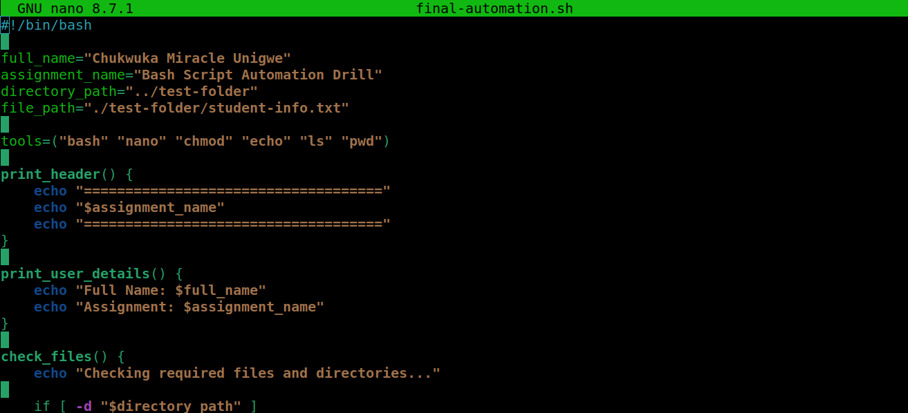

> This confirms the bug noted below: `directory_path="../test-folder"` (line 4) doesn't match `file_path="./test-folder/student-info.txt"` (line 5) or `file-check.sh`'s `./test-folder`. Fix `directory_path` to `"./test-folder"` before the final rerun.

---

#### Screenshot 2 — Output of `./final-automation.sh`

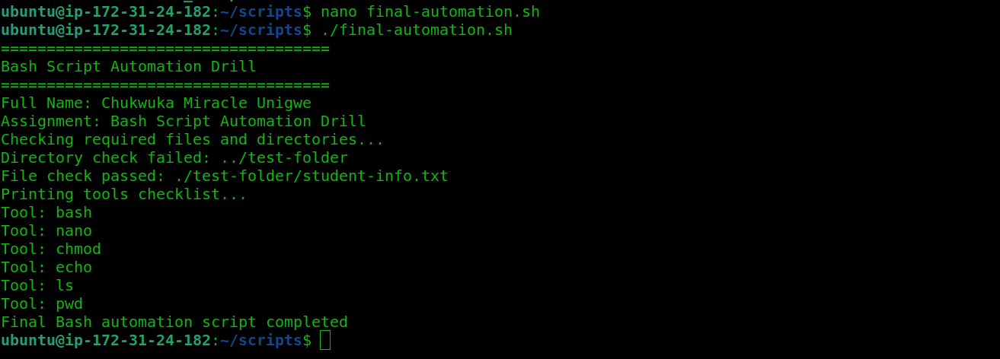

> ⚠️ This run shows `Directory check failed: ../test-folder` — see note below the Notes section about a path bug to fix before re-running for a clean screenshot.

---

#### Screenshot 3 — Output of `ls -lah` showing all created scripts

---

### Notes

Answer the following in your own words:

**1. What is a function in Bash?**

A named, reusable block of code defined once with `function_name() { ... }` and then called by name whenever that logic needs to run, optionally with arguments.

---

**2. Why are functions useful in scripts?**

They let you organize code into logical, reusable pieces instead of duplicating commands, make scripts easier to read and maintain, and let you test/reuse individual pieces of logic independently.

---

**3. Which functions did you create in this script?**

`print_header()`, `print_user_details()`, `check_files()`, plus at least one more further down the script (for the tools checklist / score check) not visible in the current screenshot — confirm the full list against your file and add any missing ones here.

---

**4. How does this final script combine variables, arrays, loops, conditionals, files, and functions?**

Variables store reusable values (like paths and thresholds), arrays hold lists of items (like tools or files to check), loops iterate over those arrays, conditionals (if/else, `-f`/`-d`) make decisions based on file state or values, and functions wrap each of these steps into reusable, named blocks that the script calls in sequence to run the full automation.

---

> **Bug to fix before final submission:** `final-automation.sh` checks `-d ../test-folder`, which fails ("Directory check failed") because `test-folder` actually lives at `./test-folder` (a subfolder of `~/scripts`), matching what `file-check.sh` uses. Change `../test-folder` to `./test-folder` (and the matching file path) in `final-automation.sh`, rerun it, and swap in a clean screenshot showing all checks passing.

---

# LinkedIn Post (Required)

## Evidence

#### LinkedIn Post URL

Paste your LinkedIn post URL here:

`https://www.linkedin.com/posts/chuka-unigwe_devops-bash-linux-share-7487501642007830528-jF1b/?utm_source=share&utm_medium=member_desktop&rcm=ACoAADapk6QB4YPpujCaTHNEjLTFzWs0c5QVFVQ`

---

#### Screenshot — Published LinkedIn post

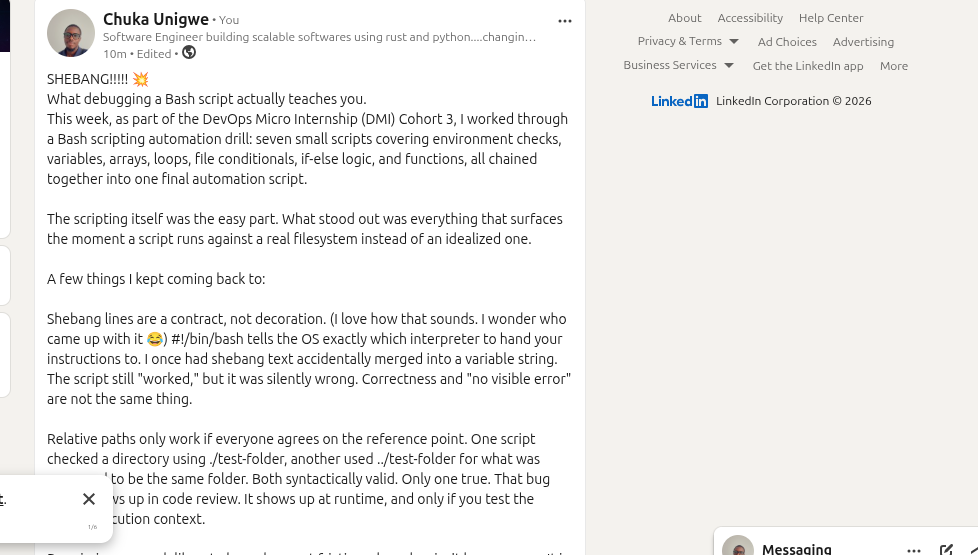

---

# Submission Instructions

- Add all required screenshots in your submission
- Full name must be visible in required screenshots
- All script files must be created and run successfully
- Required notes must be answered clearly for every task
- Do not expose sensitive information (keys, passwords, credentials)

---

# Completion Checklist

- [x] Task 1: Environment setup verified, workspace created (Screenshots 1–2, Notes answered)
- [x] Task 2: First script created, executed, permissions verified (Screenshots 1–3, Notes answered)
- [x] Task 3: Variables script created and run (Screenshots 1–2, Notes answered)
- [x] Task 4: Arrays and loops script created and run (Screenshots 1–2, Notes answered)
- [x] Task 5: Counter loop script created and run (Screenshots 1–2, Notes answered)
- [x] Task 6: File validation script created and run (Screenshots 1–3, Notes answered)
- [x] Task 7: Pass/Retry conditional script tested with both values (Screenshots 1–4, Notes answered)
- [x] Task 8: Final automation script created and run (Screenshots 1–3, Notes answered)
- [x] All scripts run without errors
- [x] Full Name visible in all required screenshots
- [x] LinkedIn post published and URL submitted
- [x] No sensitive data exposed

---

## 📌 About DMI & CloudAdvisory

DevOps Micro Internship (DMI) is a project-based DevOps program run by Pravin Mishra (The CloudAdvisory) focused on real-world execution, systems thinking, and career readiness.

It helps learners build strong DevOps foundations with hands-on experience.

---

## 📌 Resources

- 🌐 DMI Official Website: https://dmi.pravinmishra.com?utm_source=github&utm_medium=readme  
- 🎓 University: https://university.pravinmishra.com?utm_source=github&utm_medium=readme  
- 💬 Discord Community: https://discord.pravinmishra.com?utm_source=github&utm_medium=readme  
- 📝 Blog: https://dmi.pravinmishra.com/blog?utm_source=github&utm_medium=readme  
- ▶️ YouTube Playlist: https://www.youtube.com/playlist?list=PLFeSNDtI4Cho  
- 🔗 Pravin Mishra (LinkedIn): https://www.linkedin.com/in/pravin-mishra-aws-trainer/  
- 🏢 CloudAdvisory (LinkedIn): https://www.linkedin.com/company/thecloudadvisory/

---

*This submission is part of DevOps Micro Internship (DMI) Cohort 3 — Agentic AI Track.*