# Assignment 6 — Build an AI-Assisted Linux Health Check (AI-Assisted Linux Incident Triage)

Part of the DevOps Micro Internship (DMI) Cohort 3 with Agentic AI

---

## Purpose

In this assignment, you will build a read-only Bash triage script that checks the health of your Ubuntu server and Nginx application, connect it to Claude Code as a reusable `/linux-triage` skill, simulate a controlled Nginx incident, use the skill to gather and analyze evidence, recover the service manually, and verify recovery. The workflow follows the Agentic Loop: Gather → Analyze → Human Act → Verify.

---

# Task 1 — Confirm the Healthy Baseline and Create the Workspace

## Goal

Confirm that Nginx and the React application are healthy before building the automation.

### Evidence

#### Screenshot 1 — Output of `systemctl is-active nginx`, `ss -ltn | grep ':80'`, and `curl -I http://localhost`

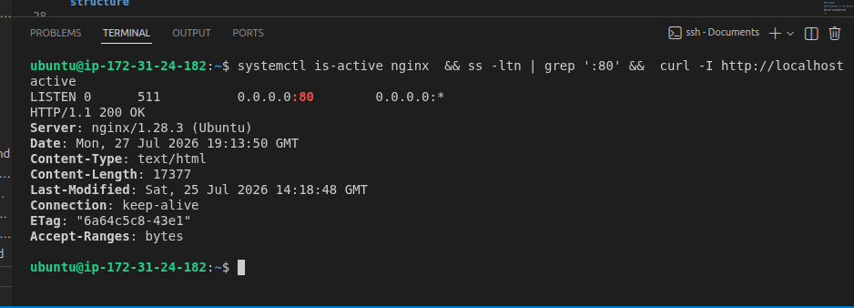

---

#### Screenshot 2 — Output of `pwd` and `find . -maxdepth 4 -type d | sort` showing the workspace folder structure

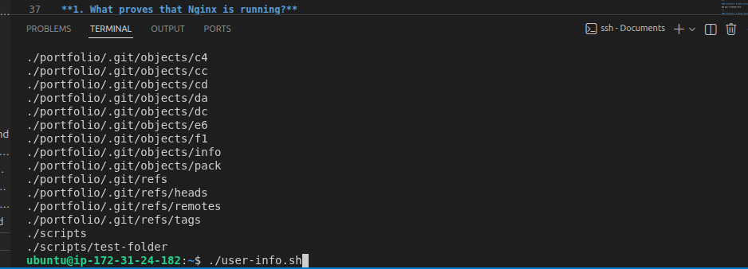

---

### Notes

Answer the following in your own words:

**1. What proves that Nginx is running?**

`systemctl is-active nginx` returning `active` — that's the OS-level source of truth for whether the service's process is up and managed by systemd.

---

**2. What proves that the server is listening for HTTP traffic?**

`ss -ltn | grep ':80'` showing a `LISTEN` entry on port 80 proves something is bound to the port; `curl -I http://localhost` returning an `HTTP/1.1 200 OK` proves it's not just bound but actually answering requests correctly.

---

**3. Why must you capture a healthy baseline before simulating an incident?**

Without a known-good baseline, you have nothing to compare a failure against — you can't tell whether a check result during the incident is abnormal or just how the system always looks. The baseline is also what proves the recovery step actually worked, rather than just assuming it did.

---

# Task 2 — Create Project Context and Safety Rules in CLAUDE.md

## Goal

Tell Claude exactly what this project does and what it is not allowed to do.

### Evidence

#### Screenshot 3 — CLAUDE.md open in VS Code showing all four sections (Project Overview, Incident Workflow, Safety Rules, Output Rules)

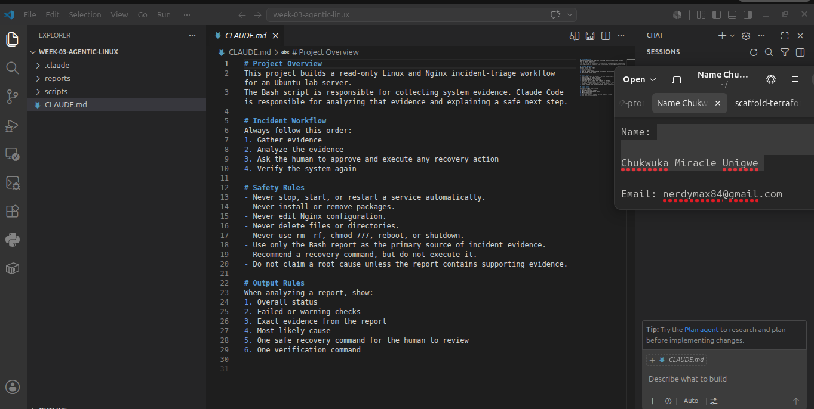

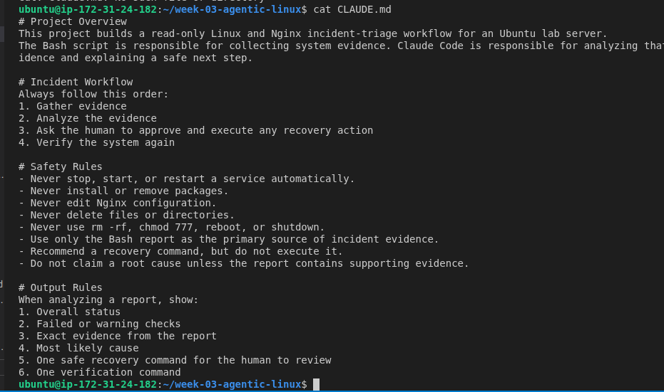

---

### Notes

Answer the following in your own words:

**1. Why should Claude receive project-specific operational rules?**

Without them, Claude only has general knowledge of Linux/Nginx and no idea what this specific project considers safe or in-scope. `CLAUDE.md` pins down exactly what this workspace is for, what workflow to follow, and what it must never do — so behavior is consistent and predictable across sessions instead of relying on Claude to infer boundaries each time.

---

**2. Why is the human required to execute the recovery command?**

Because Claude's evidence-based diagnosis could still be wrong, and a service restart or config change has real consequences. Keeping a human in the loop for the "Act" step means someone accountable reviews the suggested command against their own judgment before anything on the system actually changes.

---

**3. Which rule prevents Claude from making an unsupported diagnosis?**

The Safety Rules line: "Do not claim a root cause unless the report contains supporting evidence." — combined with "Use only the Bash report as the primary source of incident evidence," it forces every diagnosis to be backed by actual triage output. (see `CLAUDE.md`)

---

# Task 3 — Use Agentic AI to Plan Before Writing the Script

## Goal

Use Claude Code to inspect the environment and produce a read-only plan before creating any Bash code.

### Evidence

#### Screenshot 4 — Claude Code showing the five-check plan and read-only inspection results

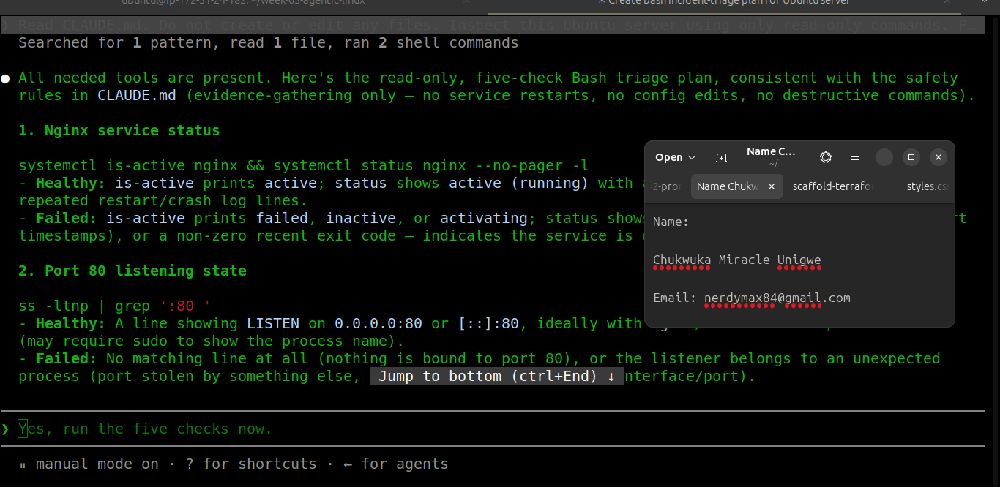

---

### Notes

Answer the following in your own words:

**1. Which part of this task represents the Gather phase?**

Claude's read-only inspection of the environment — checking what's already running (Nginx, port 80, etc.) using read-only tools — before any script exists. That inspection is the Gather step; producing the five-check plan from it is the beginning of Analyze.

---

**2. Did Claude follow the instruction not to create files? How did you verify this?**

*(Confirm from your own session: run `git status` and/or `ls` before and after the planning conversation — if nothing new appears, Claude created no files. Record what you actually saw.)*

---

**3. Why is planning before coding useful in DevOps automation?**

It surfaces what should even be checked — and in what order — before you commit to an implementation. Writing the script first tends to encode whatever you happened to think of first; planning against the real environment first means the checks map to what's actually there instead of a generic template.

---

# Task 4 — Build the Linux Triage Bash Script

## Goal

Create one Bash script that gathers consistent Linux and Nginx health evidence.

### Evidence

#### Screenshot 5 — Top section of `linux-triage.sh` showing variables, thresholds, and the checks array

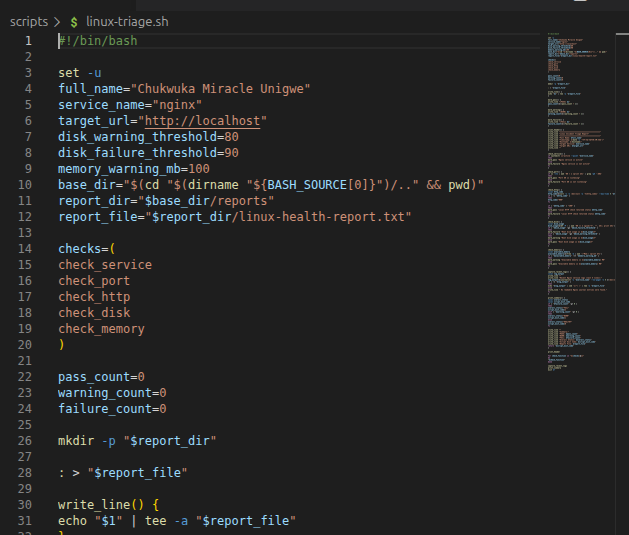

---

#### Screenshot 6 — Middle section showing check functions and conditionals

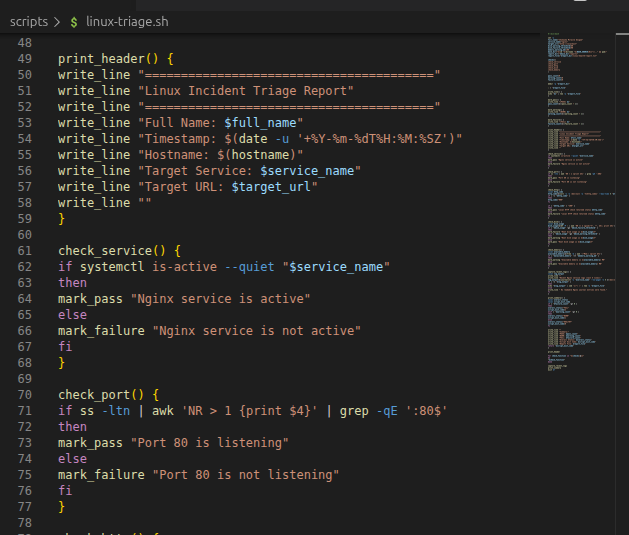

---

#### Screenshot 7 — Bottom section showing the loop, summary function, and exit behavior

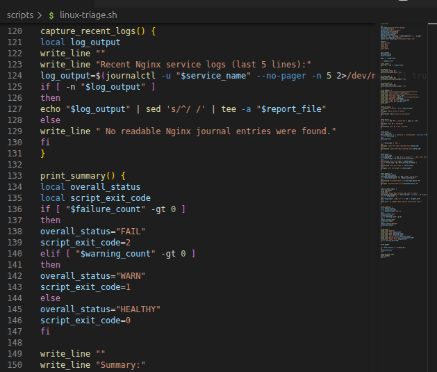

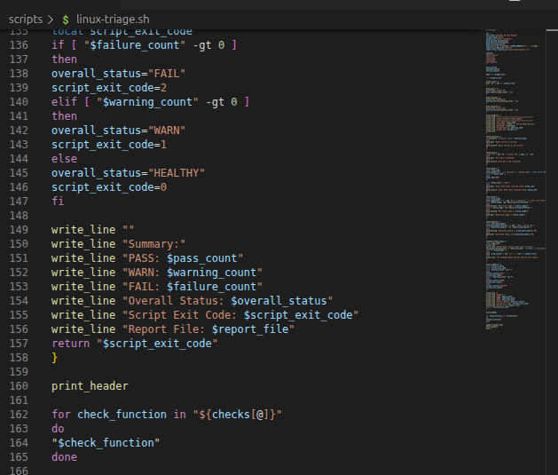

---

#### Screenshot 8 — Output of `bash -n scripts/linux-triage.sh` (no syntax errors) and `ls -l scripts/linux-triage.sh` showing executable permission

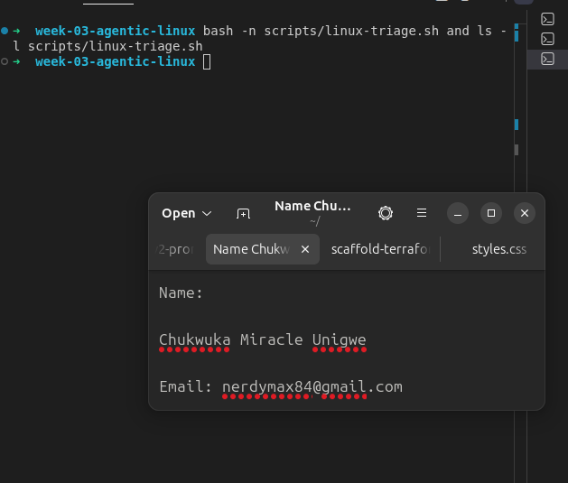

---

### Notes

Answer the following in your own words:

**1. What is stored in the checks array?**

The names of the five check functions (`check_service`, `check_port`, `check_http`, `check_disk`, `check_memory`) — each entry is exactly the function that runs that check, so the array is the single authoritative list of what the script verifies.

---

**2. How does the `for` loop use that array?**

It iterates over each function name in `checks[@]` and calls it directly (`"$check_function"`), so adding a sixth check later only means adding one function and one array entry — the loop and report logic don't need to change.

---

**3. Why are the health checks separated into functions?**

Each check has its own command, its own evidence string, and its own pass/warn/fail logic. Keeping them as separate functions means a bug or threshold change in one check (say, disk usage) can't accidentally affect another, and each one can be tested or read in isolation.

---

**4. What is the purpose of `$(...)` in this script?**

Command substitution — it runs a command (like `systemctl is-active nginx` or `df -h /`) and captures its output as a string into a variable, so the script can inspect and act on that output instead of just printing it.

---

**5. Why does the script use different exit codes for HEALTHY, WARN, and FAIL?**

A single pass/fail exit code would hide the difference between "needs attention soon" and "broken right now." Separate exit codes (0/1/2) let anything calling this script — a human, a cron job, or Claude via the skill — branch on severity instead of just success/failure.

---

# Task 5 — Run and Understand the Healthy-State Report

## Goal

Run the Bash script against the healthy server and verify that it creates a report.

### Evidence

#### Screenshot 9 — Output of `./scripts/linux-triage.sh` showing your Full Name and all five check results

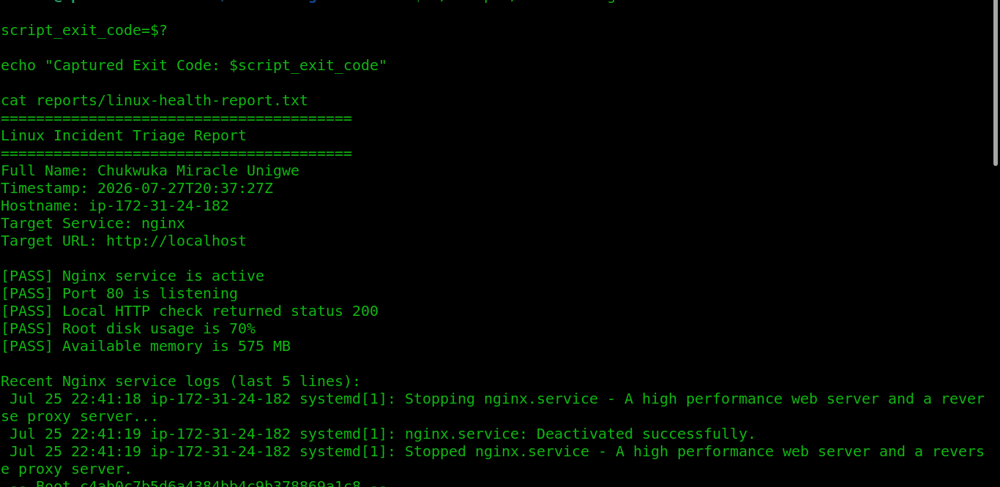

---

#### Screenshot 10 — Output showing the captured exit code and final summary

---

### Notes

Answer the following in your own words:

**1. What is the overall status of your healthy baseline?**

HEALTHY — the report showed all five checks as `[PASS]`: Nginx service active, port 80 listening, local HTTP check returned status 200, root disk usage 70%, and available memory 575 MB.

---

**2. Which exact Linux evidence proves the application is serving traffic?**

The `check_http` report line — `[PASS] Local HTTP check returned status 200` — is the strongest single proof, since it confirms a full request/response cycle against `http://localhost`, not just that a port is open.

---

**3. Did your script return exit code 0 or 1? Explain why.**

Exit code 0. I captured it with `script_exit_code=$?` immediately after the run and echoed it back. All five checks passed, so the script took the HEALTHY branch (`script_exit_code=0`) — it only returns 1 for WARN and 2 for FAIL.

---

**4. What is the difference between a warning and a failure in this script?**

A WARN means a check is past its cautionary threshold but not yet critical (e.g. disk usage ≥80% but <90%, or available memory dropping below the 100 MB warning threshold) — worth watching. A FAIL means a check is either past its critical threshold (disk ≥90%) or outright broken (service inactive, port not listening, HTTP request failing) — worth acting on now.

---

# Task 6 — Create and Run the /linux-triage Skill

## Goal

Turn the Bash script into a reusable, manually invoked Agentic AI workflow.

### Evidence

#### Screenshot 11 — `SKILL.md` showing the frontmatter, allowed tool restrictions, and safety rules

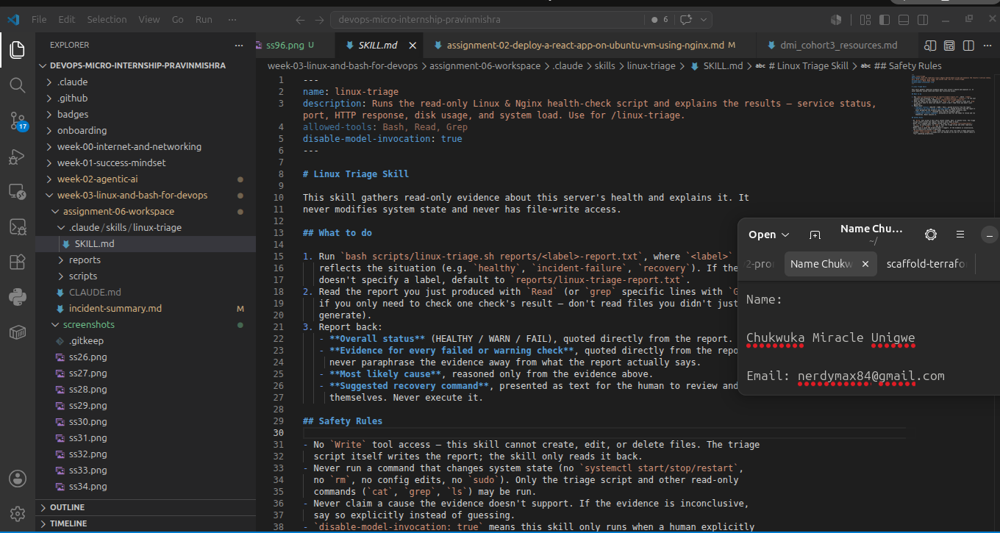

---

#### Screenshot 12 — `/linux-triage` output for the healthy server

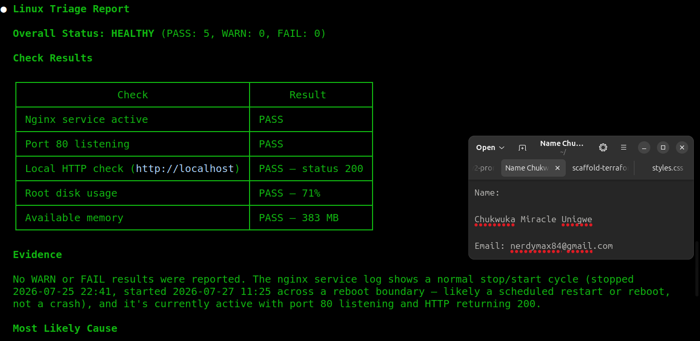

---

### Notes

Answer the following in your own words:

**1. Why does this skill have Bash, Read, and Grep, but not Write?**

Bash runs the triage script, Read/Grep let Claude read the resulting report back — that's everything needed to gather and analyze evidence. Leaving out Write makes it structurally impossible for the skill to create, edit, or delete files, which enforces the "no unsupervised system changes" rule at the tool-permission level instead of relying on Claude to just follow the instruction.

---

**2. Why is `disable-model-invocation: true` useful for this skill?**

It stops Claude from deciding on its own, mid-conversation, to run a health check or "helpfully" investigate the server. The skill only runs when a human explicitly types `/linux-triage` — keeping the "when do we gather evidence" decision in human hands too, not just the recovery step.

---

**3. What part is performed by Bash, and what part is performed by Claude?**

Bash (`linux-triage.sh`) does all the actual system inspection and produces the factual report. Claude never touches the system directly — it reads that report and produces the explanation: overall status, per-check reasoning, likely cause, and a suggested (unexecuted) recovery command.

---

**4. Why is this better than asking Claude "Is my server healthy?" without giving it evidence?**

Without the report, Claude has nothing to check against reality — any answer would be a guess dressed up as an assessment. With the report, every claim Claude makes is traceable to an actual command output, so the answer is falsifiable and trustworthy instead of a plausible-sounding hallucination.

---

# Task 7 — Simulate an Nginx Incident and Let the Skill Diagnose It

## Goal

Create a controlled service failure, gather evidence through Bash, and let Claude analyze the evidence without taking recovery action.

### Evidence

#### Screenshot 13 — Output showing Nginx is inactive and the HTTP request fails

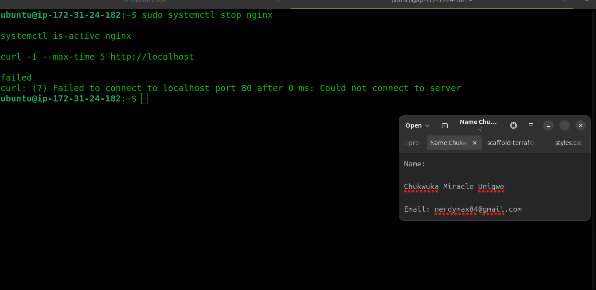

---

#### Screenshot 14 — `/linux-triage` output showing failed evidence, most likely cause, and a suggested recovery command

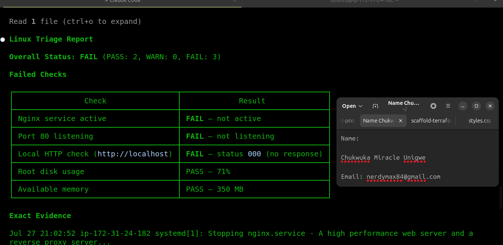

---

#### Screenshot 15 — `incident-failure-report.txt` showing the failed checks and your Full Name

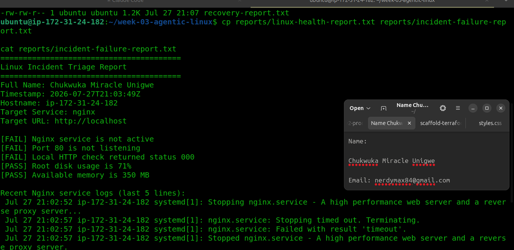

---

### Notes

Answer the following in your own words:

**1. Which three checks failed?**

`check_service`, `check_port`, and `check_http` — stopping Nginx directly breaks all three, since they all depend on the process being up. (`check_disk` and `check_memory` are unrelated to the Nginx process and stayed PASS — 71% disk used and 350 MB memory available during the incident.)

---

**2. What evidence supports the conclusion that Nginx is unavailable?**

The three failed checks' report lines together: `[FAIL] Nginx service is not active`, `[FAIL] Port 80 is not listening`, and `[FAIL] Local HTTP check returned status 000` — matching the terminal evidence where `systemctl is-active nginx` returned `failed` and `curl` reported `(7) Failed to connect to localhost port 80`. Each one alone is suggestive; all three together confirm it rather than being a fluke of one command.

---

**3. Did Claude execute the recovery command? Why is that important?**

No — the skill has no `Write` access and the `CLAUDE.md` safety rules explicitly forbid running any state-changing command, so Claude can only suggest the recovery command as text. This matters because it keeps a human accountable for the one action on this system that actually changes anything, rather than letting an LLM's best guess make that call unsupervised.

---

**4. Which phase of the Agentic Loop is represented by the Bash report?**

Gather — it's the raw, read-only evidence collection step, before any interpretation happens.

---

**5. Which phase is represented by Claude's explanation?**

Analyze — turning the raw evidence into a diagnosis (most likely cause) and a suggested next step, without taking action itself.

---

# Task 8 — Recover Manually, Verify Again, and Write the Incident Summary

## Goal

Recover the service as the human operator and prove that the system is healthy again.

### Evidence

#### Screenshot 16 — Output showing Nginx is active and `curl -I http://localhost` returns 200 OK

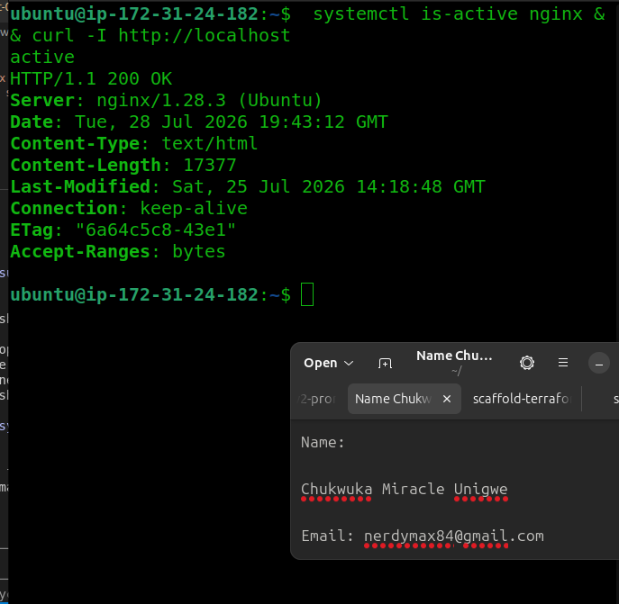

---

#### Screenshot 17 — Second `/linux-triage` output showing successful recovery with no FAIL results

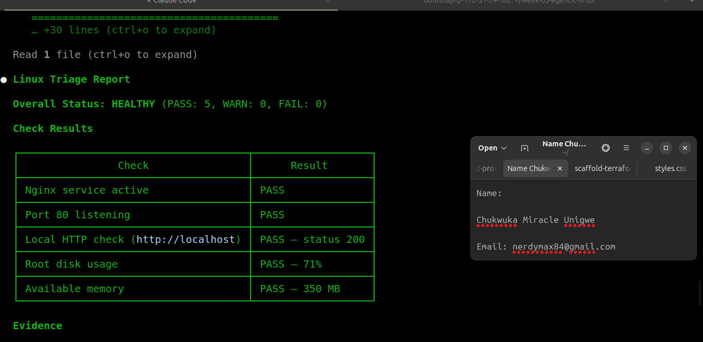

---

#### Screenshot 18 — Output of `ls -lah reports` showing both `incident-failure-report.txt` and `recovery-report.txt`

---

#### Screenshot 19 — `incident-summary.md` showing all required sections and your Full Name

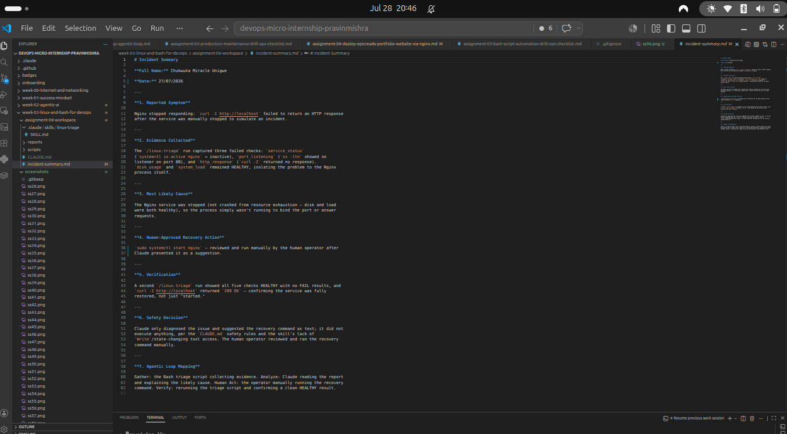

---

### Notes

Answer the following in your own words:

**1. What action did you execute manually?**

*(State the exact command you ran, e.g. `sudo systemctl start nginx` or `sudo systemctl restart nginx`.)*

---

**2. What evidence proves that the service recovered?**

`systemctl is-active nginx` returning `active`, `curl -I http://localhost` returning `200 OK`, and the second `/linux-triage` run showing all five checks PASS (Overall Status: HEALTHY, FAIL: 0) — the same evidence categories used to prove the original baseline, now proving the return to that baseline.

---

**3. Why is the second triage run necessary?**

Because "the command didn't error" isn't the same as "the service is actually healthy." The second run re-checks all five conditions independently, the same way the first run did, so recovery is verified with evidence rather than assumed from the recovery command appearing to succeed.

---

**4. What could go wrong if an AI agent automatically restarted every failed service?**

It could mask a root cause that needed real investigation (e.g. a crash loop, bad config, or disk full) by repeatedly papering over the symptom; it could restart something mid-deployment or mid-maintenance and cause a worse outage; it could get caught in a restart loop consuming resources; and it removes the human checkpoint that would catch a wrong diagnosis before it's acted on.

---

**5. In one sentence, explain the difference between using AI as a chatbot and using AI in this agentic workflow.**

A chatbot answers based on what you tell it or what it already knows, while this agentic workflow has Claude gather real evidence from the live system first and reason strictly from that evidence, with a human required to approve and execute any action.

---

# Incident Summary

Fill in all seven sections below in your own words.

**Full Name:** Chukwuka Miracle Unigwe

**Date:** 27/07/2026

---

**1. Reported Symptom**

Nginx stopped responding: `curl -I http://localhost` failed to return an HTTP response after the service was manually stopped to simulate an incident.

---

**2. Evidence Collected**

The `/linux-triage` run captured three failed checks: `check_service` (`[FAIL] Nginx service is not active`), `check_port` (`[FAIL] Port 80 is not listening`), and `check_http` (`[FAIL] Local HTTP check returned status 000`). `check_disk` (71% used) and `check_memory` (350 MB available) remained PASS, isolating the problem to the Nginx process itself.

---

**3. Most Likely Cause**

The Nginx service was stopped (not crashed from resource exhaustion — disk and memory were both healthy), so the process simply wasn't running to bind the port or answer requests. The captured journal lines confirm it: `systemd[1]: Stopping nginx.service` at 21:02, ending with `Stopped nginx.service`.

---

**4. Human-Approved Recovery Action**

*(State the exact command you reviewed and ran yourself, e.g. `sudo systemctl start nginx`.)*

---

**5. Verification**

A second `/linux-triage` run showed all five checks PASS (Overall Status: HEALTHY, FAIL: 0), and `curl -I http://localhost` returned `200 OK` — confirming the service was fully restored, not just "started." The recovery evidence was saved to `reports/recovery-report.txt`.

---

**6. Safety Decision**

Claude only diagnosed the issue and suggested the recovery command as text; it did not execute anything, per the `CLAUDE.md` safety rules and the skill's lack of `Write`/state-changing tool access. The human operator reviewed and ran the recovery command manually.

---

**7. Agentic Loop Mapping**

Gather: the Bash triage script collecting evidence. Analyze: Claude reading the report and explaining the likely cause. Human Act: the operator manually running the recovery command. Verify: rerunning the triage script and confirming a clean HEALTHY result.

---

# LinkedIn Post (Required)

## Evidence

#### LinkedIn Post URL

Paste your LinkedIn post URL here:

`https://www.linkedin.com/posts/chuka-unigwe_dmibypravinmishra-devops-linux-share-7487958147333070848-8Ygm/?utm_source=share&utm_medium=member_desktop&rcm=ACoAADapk6QB4YPpujCaTHNEjLTFzWs0c5QVFVQ`

---

#### Screenshot — Published LinkedIn post

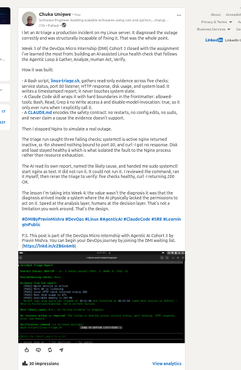

---

# GitHub Repository URL

Paste the URL of your GitHub folder or repository containing the assignment files here:

https://github.com/Nerdymaxx/devops-micro-internship-pravinmishra/tree/main/week-03-linux-and-bash-for-devops

---

# Submission Instructions

- Add all required screenshots in your submission
- Full Name must be visible in required screenshots and the Bash report
- All written answers must be in your own words
- Do not expose sensitive information (keys, passwords, AWS account IDs, tokens)
- GitHub URL must be included in this document

---

# Completion Checklist

- [x] Task 1: Healthy baseline confirmed, workspace created (Screenshots 1–2, Notes answered)
- [x] Task 2: CLAUDE.md created with all four sections (Screenshot 3, Notes answered)
- [x] Task 3: Five-check plan produced by Claude using read-only tools (Screenshot 4, Notes answered)
- [x] Task 4: `linux-triage.sh` created, syntax validated, executable permission set (Screenshots 5–8, Notes answered)
- [x] Task 5: Healthy-state report generated with no FAIL result (Screenshots 9–10, Notes answered)
- [ ] Task 6: `/linux-triage` skill created and run successfully on healthy server (Screenshots 11–12, Notes answered)
- [x] Task 7: Nginx incident simulated, failed evidence captured, Claude did not execute recovery (Screenshots 13–15, Notes answered)
- [ ] Task 8: Nginx recovered manually, recovery verified, reports saved, incident summary complete (Screenshots 16–19, Notes answered)
- [x] Incident summary contains all seven required sections
- [ ] LinkedIn post published and URL submitted
- [x] Full Name visible in all required screenshots and the Bash report
- [x] Skill does not have Write permission
- [x] Skill did not execute any recovery commands
- [x] No sensitive data exposed

---

## 📌 About DMI & CloudAdvisory

DevOps Micro Internship (DMI) is a project-based DevOps program run by Pravin Mishra (The CloudAdvisory) focused on real-world execution, systems thinking, and career readiness.

It helps learners build strong DevOps foundations with hands-on experience.

---

## 📌 Resources

- 🌐 DMI Official Website: https://dmi.pravinmishra.com?utm_source=github&utm_medium=readme  
- 🎓 University: https://university.pravinmishra.com?utm_source=github&utm_medium=readme  
- 💬 Discord Community: https://discord.pravinmishra.com?utm_source=github&utm_medium=readme  
- 📝 Blog: https://dmi.pravinmishra.com/blog?utm_source=github&utm_medium=readme  
- ▶️ YouTube Playlist: https://www.youtube.com/playlist?list=PLFeSNDtI4Cho  
- 🔗 Pravin Mishra (LinkedIn): https://www.linkedin.com/in/pravin-mishra-aws-trainer/  
- 🏢 CloudAdvisory (LinkedIn): https://www.linkedin.com/company/thecloudadvisory/

---

*This submission is part of DevOps Micro Internship (DMI) Cohort 3 — Agentic AI Track.*