# Assignment 2 — CodeTrack: Tracking, Staging, Committing + Deploy to EC2

Part of the DevOps Micro Internship (DMI) Cohort 3 with Agentic AI

---

## Purpose

In this assignment, you will track and stage project files, create two meaningful Git commits in `CodeTrack`, verify your commit history, and deploy the CodeTrack static website to an EC2 instance using Nginx. This connects local version-control practice with a basic manual deployment workflow used in real DevOps environments.

---

# Task 1 — Verify Git Setup and Enter the Repository

## Goal

Confirm that Git works and that you are inside the correct `CodeTrack` repository.

### Evidence

#### Screenshot 1 — Output of `pwd` showing you're inside `CodeTrack`

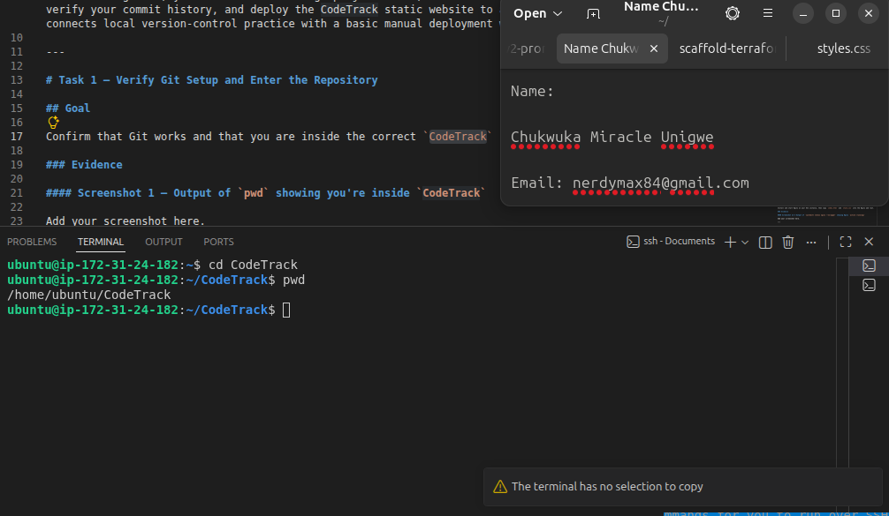

---

#### Screenshot 2 — Output of `git status` showing no "not a git repository" error

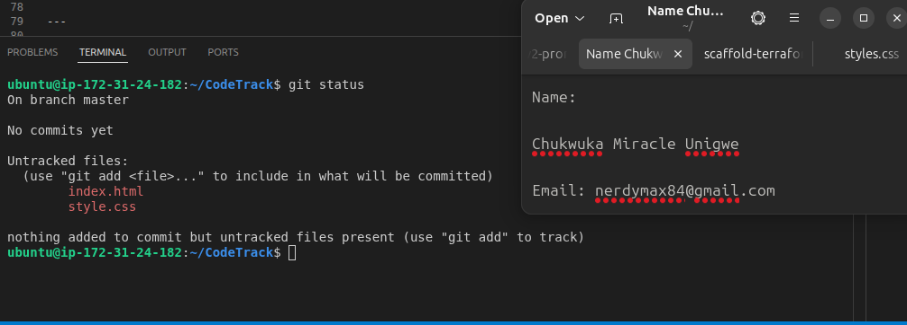

---

# Task 2 — Create index.html and style.css

## Goal

Create the two starter UI files inside `CodeTrack`.

### Evidence

#### Screenshot 3 — Output of `ls` showing `index.html` and `style.css`

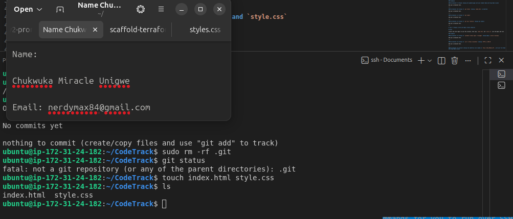

---

# Task 3 — Add Starter Content

## Goal

Copy the provided starter HTML and CSS content into your local `index.html` and `style.css` files.

### Evidence

#### Screenshot 4 — Your editor showing the contents of `index.html` and `style.css`

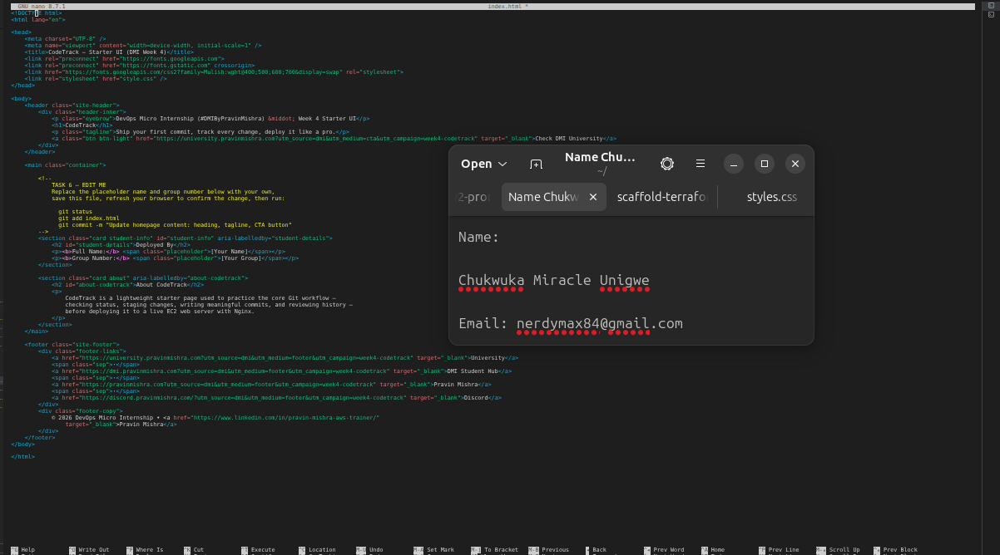

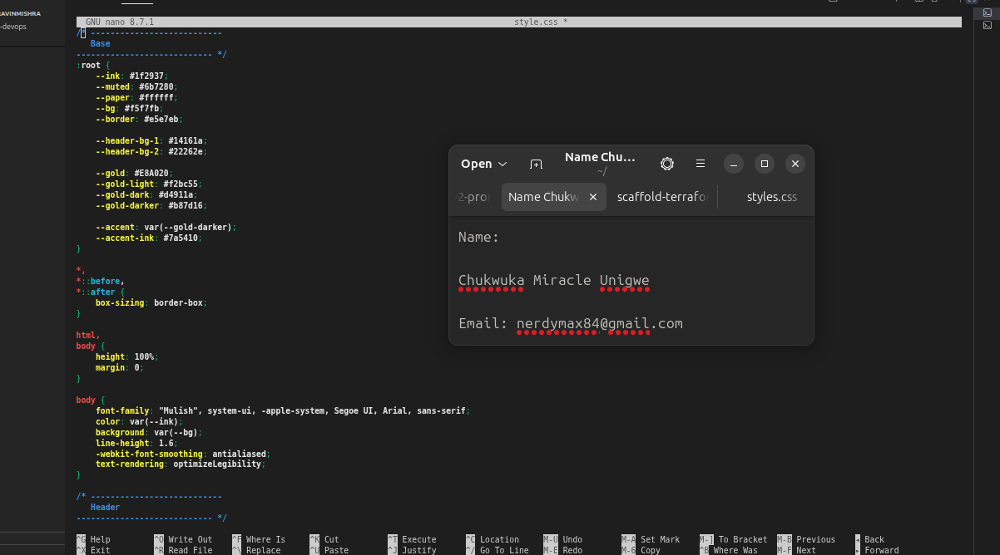

---

# Task 4 — Track and Stage Files Correctly

## Goal

Confirm both files show as untracked, then stage them individually with `git add`.

### Evidence

#### Screenshot 5 — Output of `git status` showing both files as untracked

---

#### Screenshot 6 — Output of `git status` showing both files staged under "Changes to be committed"

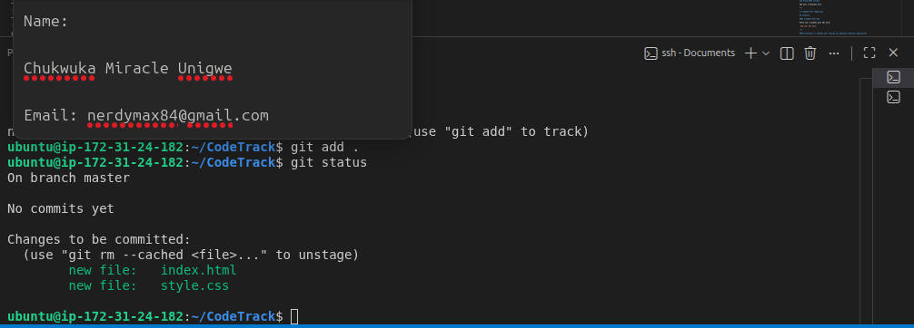

---

# Task 5 — Create the First Commit (Clean Initial Commit)

## Goal

Commit the staged starter files using the message `Initial UI scaffold: add index.html and style.css`, then check the log.

### Evidence

#### Screenshot 7 — Output of `git commit`

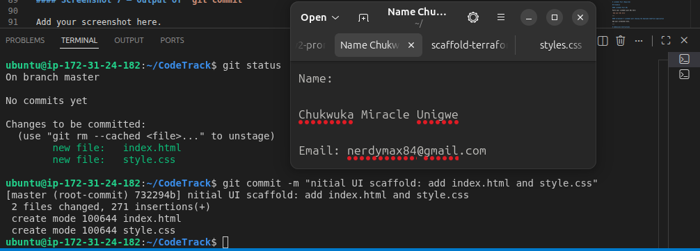

---

#### Screenshot 8 — Output of `git log --oneline` showing the first commit

Add your screenshot here.

---

# Task 6 — Modify index.html and Create a Second Commit

## Goal

Follow the instruction comment inside `index.html` to update the Student Name and Group Name, then commit that change separately using the message `Update homepage content: heading, tagline, CTA button`.

### Evidence

#### Screenshot 9 — Browser showing the updated page with your Student Name and Group Name visible

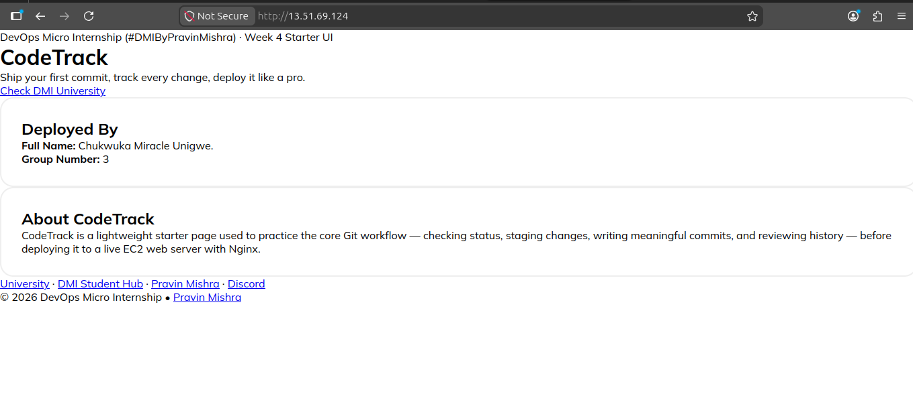

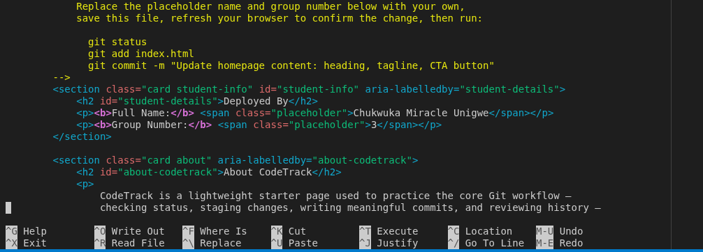

---

#### Screenshot 10 — Output of `git status` showing `index.html` as modified

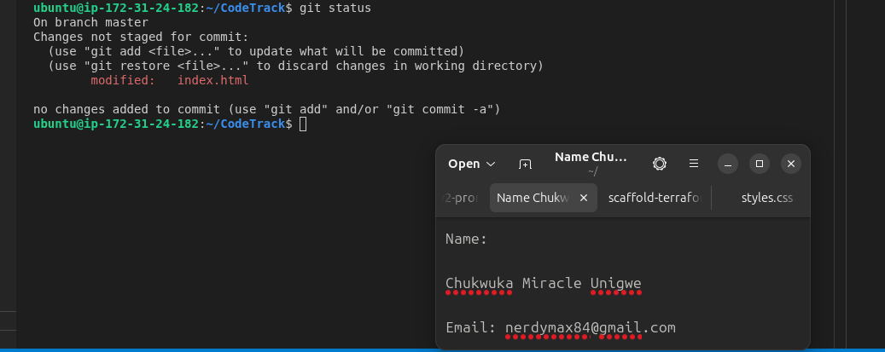

---

#### Screenshot 11 — Output of `git commit`

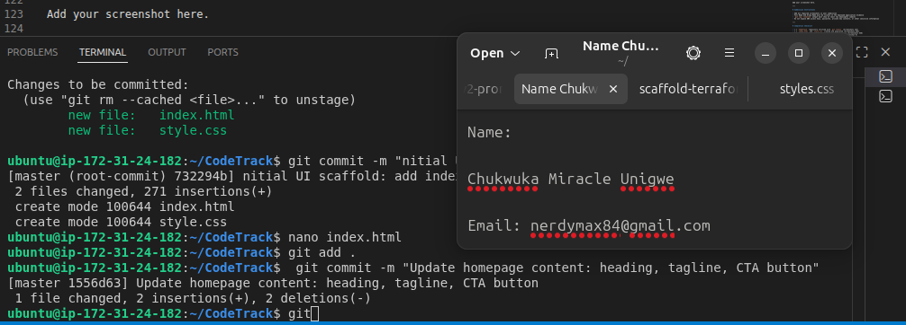

---

#### Screenshot 12 — Output of `git log --oneline` showing two commits

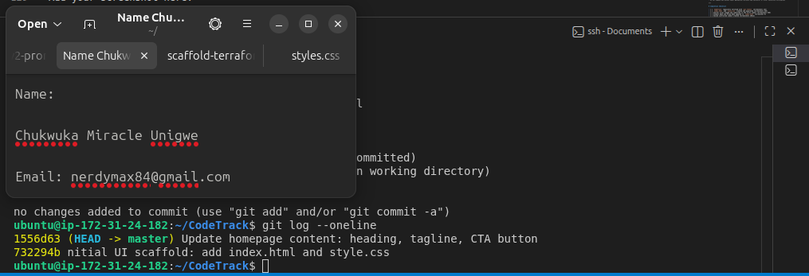

---

# Task 7 — Deploy to EC2 with Nginx (Static Website)

## Goal

Install and start Nginx on your EC2 instance, then copy `index.html` and `style.css` into the Nginx web root.

### Evidence

#### Screenshot 13 — Output of `systemctl status nginx --no-pager` showing Nginx `active (running)`

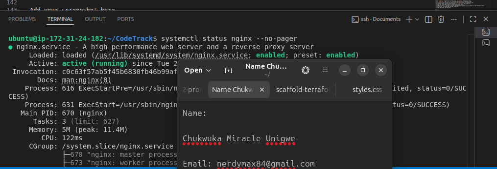

---

#### Screenshot 14 — Output of `curl -I http://localhost` showing `HTTP/1.1 200 OK`

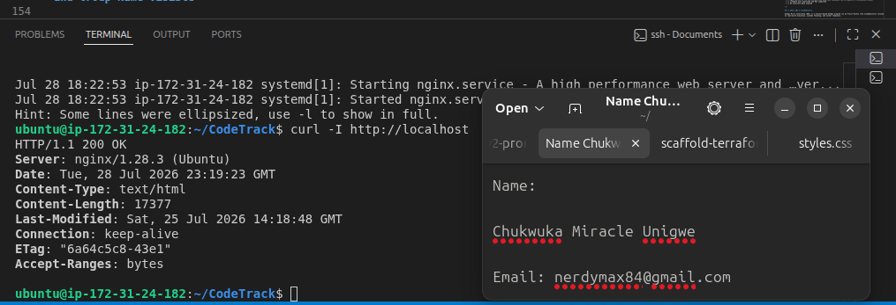

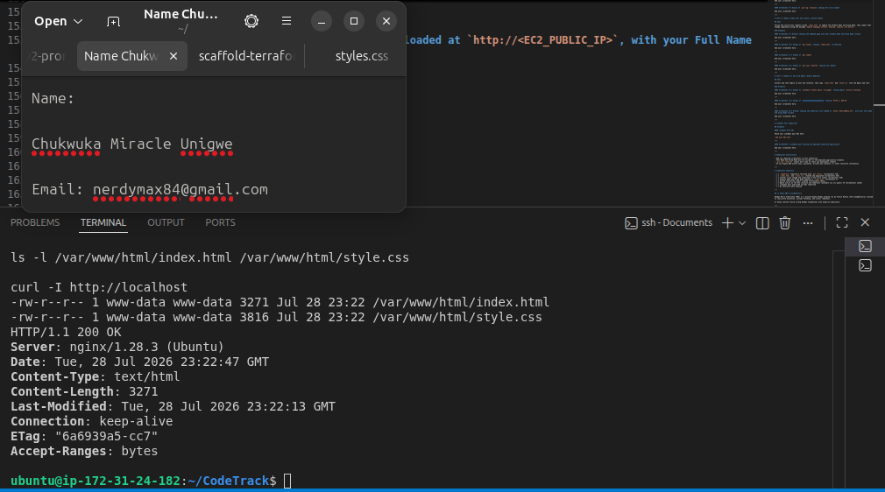

---

#### Screenshot 15 — Browser showing the CodeTrack site loaded at `http://<EC2_PUBLIC_IP>`, with your Full Name and Group Name visible

---

# LinkedIn Post (Required)

## Evidence

#### LinkedIn Post URL

Paste your LinkedIn post URL here:

`Add your URL here`

---

#### Screenshot — LinkedIn post showing the deployed CodeTrack application

Add your screenshot here.

---

# Submission Instructions

- Add all required screenshots in your submission
- Full Name and Group Name must be visible in the deployed application evidence
- `git log --oneline` output must show at least two meaningful commits
- Do not expose AWS access keys, passwords, private key contents, or other sensitive information

---

# Completion Checklist

- [x] `CodeTrack` repository verified with `git status` (Screenshots 1–2)
- [x] `index.html` and `style.css` created and populated (Screenshots 3–4)
- [x] Starter files staged and committed in the first commit (Screenshots 5–8)
- [x] Student Name and Group Name updated in `index.html` (Screenshot 9)
- [x] Second controlled commit created (Screenshots 10–12)
- [x] Nginx active on the EC2 instance and CodeTrack reachable via its public IP (Screenshots 13–15)
- [ ] LinkedIn post published and URL submitted
- [x] No sensitive data exposed

---

## 📌 About DMI & CloudAdvisory

DevOps Micro Internship (DMI) is a project-based DevOps program run by Pravin Mishra (The CloudAdvisory) focused on real-world execution, systems thinking, and career readiness.

It helps learners build strong DevOps foundations with hands-on experience.

---

## 📌 Resources

- 🌐 DMI Official Website: https://dmi.pravinmishra.com?utm_source=github&utm_medium=readme  
- 🎓 University: https://university.pravinmishra.com?utm_source=github&utm_medium=readme  
- 💬 Discord Community: https://discord.pravinmishra.com?utm_source=github&utm_medium=readme  
- 📝 Blog: https://dmi.pravinmishra.com/blog?utm_source=github&utm_medium=readme  
- ▶️ YouTube Playlist: https://www.youtube.com/playlist?list=PLFeSNDtI4Cho  
- 🔗 Pravin Mishra (LinkedIn): https://www.linkedin.com/in/pravin-mishra-aws-trainer/  
- 🏢 CloudAdvisory (LinkedIn): https://www.linkedin.com/company/thecloudadvisory/

---

*This submission is part of DevOps Micro Internship (DMI) Cohort 3 — Agentic AI Track.*
